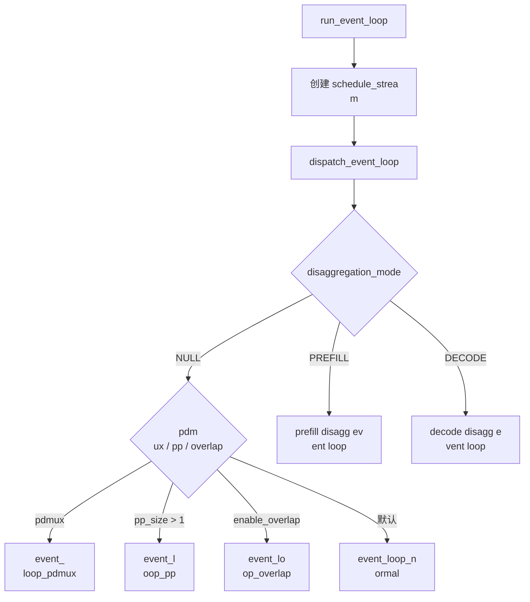
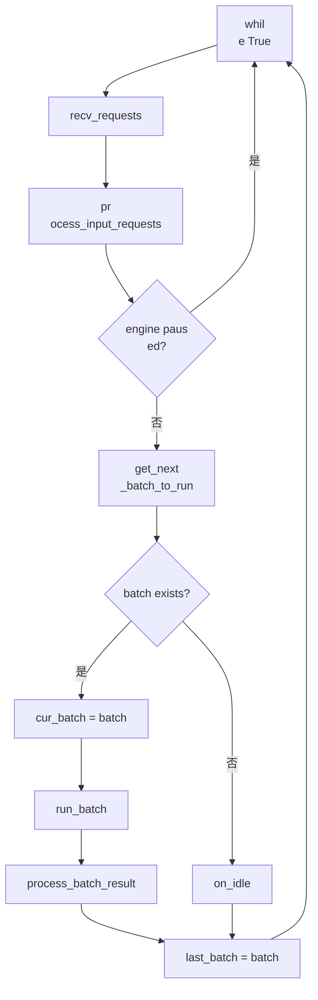

# Scheduler 流程图

## 1. Scheduler 进程
启动

对应源码：

- `python/sglang/srt
/managers/scheduler.py:run_scheduler_process`

- `python/sglang/srt/managers/scheduler.py:c
onfigure_scheduler_process`
- `python/sglang/
srt/managers/scheduler.py:Scheduler.__init__`

- `python/sglang/srt/managers/scheduler.py:S
cheduler.run_event_loop`

```mermaid
flowchar
t TD
  A["run_scheduler_process"] --> B["load
_plugins"]
  B --> C["configure_scheduler_pro
cess: 日志 / 进程名 / CPU 亲和性 / NU
MA"]
  C --> D["Scheduler(...)"]
  D --> E["�
��始化并行状态和模型配置"]
  E -->
 F["初始化 IPC / tokenizer / metrics / wor
ker"]
  F --> G["构建 KV cache: req_to_toke
n_pool / token_to_kv_pool / tree_cache"]
  G 
--> H["初始化调度策略 / grammar / LoRA
 / profiler / disaggregation / overlap"]
  H 
--> I["pipe_writer.send(get_init_info)"]
  I 
--> J["run_event_loop"]
```

## 2. Event loop
 分发

对应源码：

- `scheduler.py:Sch
eduler.run_event_loop`
- `scheduler.py:dispat
ch_event_loop`



## 3. 普通事件循环

�
�应源码：`scheduler.py:Scheduler.event_lo
op_normal`



## 4. 
Overlap 事件循环

对应源码：

- `sch
eduler.py:Scheduler.event_loop_overlap`
- `sc
heduler.py:Scheduler.is_disable_overlap_for_b
atch`
- `scheduler.py:Scheduler.launch_batch_
sample_if_needed`

```mermaid
flowchart TD
  
A["while True"] --> B["recv_requests + proces
s_input_requests"]
  B --> C{"engine paused?"
}
  C -->|是| A
  C -->|否| D["必要时等
待 forward_stream"]
  D --> E["get_next_batc
h_to_run"]
  E --> F["判断是否临时关�
� overlap"]
  F --> G{"需要先处理上轮�
��果?"}
  G -->|是| H["pop_and_process: pro
cess_batch_result(last_batch)"]
  G -->|否| 
I["跳过"]
  H --> J["run_batch 当前 batch
"]
  I --> J
  J --> K["result_queue.append(b
atch.copy, result)"]
  K --> L{"可处理上�
��轮结果?"}
  L -->|是| M["pop_and_proces
s"]
  L -->|否| N["保留 result_queue"]
  M
 --> O["launch_batch_sample_if_needed"]
  N -
-> O
  O --> P["last_batch = batch"]
  P --> 
A
```

## 5. 输入请求到 waiting_queue

�
��应源码：

- `scheduler.py:Scheduler.pro
cess_input_requests`
- `scheduler.py:Schedule
r.init_request_dispatcher`
- `scheduler.py:Sc
heduler.handle_generate_request`
- `scheduler
.py:Scheduler._add_request_to_queue`

```merm
aid
flowchart TD
  A["recv_requests 得到 re
cv_req"] --> B["process_input_requests"]
  B 
--> C{"健康检查且 GPU 忙?"}
  C -->|是
| D["暂存 http_worker_ipc 到 return_health
_check_ipcs"]
  C -->|否| E["TypeBasedDispat
cher 按类型分发"]
  E --> F{"TokenizedGe
nerateReqInput?"}
  F -->|是| G["handle_gene
rate_request"]
  G --> H["创建 Req / sessio
n req"]
  H --> I["处理 input_embeds / 多�
��态 / mrope / logprob / grammar"]
  I --> J
{"grammar 需要等待?"}
  J -->|是| K["进
入 grammar_queue"]
  J -->|否| L["_add_requ
est_to_queue"]
  L --> M{"disaggregation_mode
"}
  M -->|NULL| N["append waiting_queue"]
  
M -->|PREFILL| O["disagg_prefill_bootstrap_qu
eue.add"]
  M -->|DECODE| P["disagg_decode_pr
ealloc_queue.add"]
```

## 6. get_next_batch_
to_run 决策

对应源码：

- `scheduler.
py:Scheduler.get_next_batch_to_run`
- `schedu
ler.py:Scheduler.get_new_batch_prefill`
- `sc
heduler.py:Scheduler._get_new_batch_prefill_r
aw`
- `scheduler.py:Scheduler.update_running_
batch`

```mermaid
flowchart TD
  A["get_next
_batch_to_run"] --> B["检查 waiting/running
 timeout"]
  B --> C["处理 chunked_req / dl
lm / hisparse 的特殊状态"]
  C --> D{"la
st_batch 是 extend?"}
  D -->|是| E["filter
 last_batch 并 merge 到 running_batch"]
  D
 -->|否| F["跳过"]
  E --> G["清理 prefi
ll-only running_batch"]
  F --> G
  G --> H["
get_new_batch_prefill"]
  H --> I{"new prefil
l batch?"}
  I -->|是| J["返回 prefill bat
ch"]
  I -->|否| K{"running_batch 可 decode
?"}
  K -->|是| L["update_running_batch"]
  
L --> M["返回 decode batch"]
  K -->|否| N
["返回 None"]
```

## 7. Prefill batch 构�
��

对应源码：`scheduler.py:Scheduler._g
et_new_batch_prefill_raw`

```mermaid
flowcha
rt TD
  A["_get_new_batch_prefill_raw"] --> B
["grammar ready 请求重新入队"]
  B --> 
C["HiCache 异步事件检查"]
  C --> D{"ru
nning_batch full 且没有 chunked_req?"}
  D
 -->|是| Z["return None"]
  D -->|否| E["po
licy.calc_priority(waiting_queue, running_bat
ch)"]
  E --> F["创建 PrefillAdder"]
  F --
> G{"已有 chunked_req?"}
  G -->|是| H["ad
der.add_chunked_req"]
  G -->|否| I["遍历 
waiting_queue"]
  H --> I
  I --> J["LoRA / r
equest slot / KV token / HiCache prefetch 检
查"]
  J --> K["req.init_next_round_input"]

  K --> L["adder.add_one_req"]
  L --> M{"还
能继续加请求?"}
  M -->|是| I
  M -->|
否| N["更新 waiting_queue / preempt_list /
 chunked_req"]
  N --> O["ScheduleBatch.init_
new"]
  O --> P["prepare_for_extend"]
  P -->
 Q{"mixed chunked prefill?"}
  Q -->|是| R["
mix_with_running"]
  Q -->|否| S["返回 new
_batch"]
  R --> S
```

## 8. run_batch 与�
�果处理

对应源码：

- `scheduler.py:
Scheduler.run_batch`
- `scheduler.py:Schedule
r.process_batch_result`
- `scheduler_componen
ts/batch_result_processor.py:process_batch_re
sult_prefill`
- `scheduler_components/batch_r
esult_processor.py:process_batch_result_decod
e`

```mermaid
flowchart TD
  A["run_batch"] 
--> B["forward_ct += 1 / profiler"]
  B --> C
{"generation or embedding?"}
  C -->|generati
on| D{"enable_overlap?"}
  D -->|是| E["reso
lve future_map / forward_stream / isolation"]

  E --> F["model_worker.forward_batch_genera
tion"]
  F --> G["stash next token / copy_to_
cpu or delayed sample"]
  D -->|否| H["resol
ve_forward_inputs"]
  H --> I["model_worker.f
orward_batch_generation"]
  I --> J["future_m
ap.stash / update_cache_from_scheduler"]
  C 
-->|embedding| K["forward_batch_embedding"]
 
 G --> L["process_batch_result"]
  J --> L
  
K --> L
  L --> M{"forward_mode"}
  M -->|dec
ode| N["process_batch_result_decode"]
  M -->
|extend/prefill| O["process_batch_result_pref
ill or disagg/dllm"]
  M -->|prebuilt| P["pro
cess_batch_result_prebuilt"]
  M -->|idle| Q[
"process_batch_result_idle"]
  N --> R["metri
cs / health check / cleanup"]
  O --> R
  P -
-> R
  Q --> R
```


