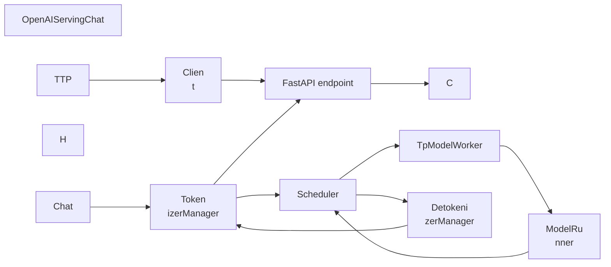

# 第 1 讲：一次 ChatCompletion 请求的
完整生命周期

本讲目标：理解一�
�� OpenAI-compatible `/v1/chat/completions` �
��求如何进入 SGLang，如何被转换成
内部请求、tokenize、调度、送入模�
��前向计算，并最终 detokenize 后返�
��客户端。

## 一句话总览

SGLang �
�生成请求主链可以先看成 8 个关�
�：



对应的数据结构变�
��是：

```mermaid
flowchart TD
  A["ChatCo
mpletionRequest"] --> B["GenerateReqInput"]
 
 B --> C["TokenizedGenerateReqInput"]
  C -->
 D["Req"]
  D --> E["ScheduleBatch"]
  E --> 
F["ForwardBatch"]
  F --> G["GenerationBatchR
esult"]
  G --> H["BatchTokenIDOutput"]
  H -
-> I["BatchStrOutput"]
  I --> J["OpenAI resp
onse / SSE chunk"]
```

## 阶段 1：HTTP �
�口

| 文件 | 函数 / 代码段 | 作用 
|
|---|---|---|
| `python/sglang/srt/entrypoi
nts/http_server.py` | `openai_v1_chat_complet
ions()` | FastAPI 的 `/v1/chat/completions` 
路由入口。 |
| `python/sglang/srt/entryp
oints/http_server.py` | `raw_request.app.stat
e.openai_serving_chat.handle_request(...)` | 
把 HTTP 请求交给 OpenAI chat adapter。 
|

关键代码段：

```python
@app.post("/
v1/chat/completions", dependencies=[Depends(v
alidate_json_request)])
async def openai_v1_c
hat_completions(
    request: ChatCompletionR
equest, raw_request: Request
):
    return aw
ait raw_request.app.state.openai_serving_chat
.handle_request(
        request, raw_request

    )
```

这一层基本不理解模型，
也不理解调度，只负责把请求交给
 `OpenAIServingChat`。

## 阶段 2：OpenAI
 请求转内部请求

| 文件 | 类 / 函�
�� | 重点代码段 |
|---|---|---|
| `pytho
n/sglang/srt/entrypoints/openai/serving_base.
py` | `OpenAIServingBase.handle_request()` | 
调 `_validate_request()`、`_convert_to_inte
rnal_request()`，再按 `stream` 分到 `_ha
ndle_streaming_request()` 或 `_handle_non_st
reaming_request()`。 |
| `python/sglang/srt/
entrypoints/openai/serving_chat.py` | `OpenAI
ServingChat._convert_to_internal_request()` |
 构造 `GenerateReqInput`，这是进入 SGL
ang 内部生成引擎的请求对象。 |
| 
`python/sglang/srt/entrypoints/openai/serving
_chat.py` | `OpenAIServingChat._process_messa
ges()` | 处理 messages、chat template、to
ols、reasoning parser、多模态输入。 |

| `python/sglang/srt/entrypoints/openai/serv
ing_chat.py` | `request.to_sampling_params(..
.)` 调用点 | 把 OpenAI 参数转换成 SG
Lang sampling params。 |

心智模型：

`
``mermaid
flowchart TD
  A["OpenAI messages"]
 --> B["_process_messages"]
  B --> C["prompt
 / prompt_ids / media inputs"]
  A --> D["to_
sampling_params"]
  C --> E["GenerateReqInput
"]
  D --> E
```

读这里时要关注：`Ch
atCompletionRequest` 不是直接送给 Sched
uler，而是先被 adapter 翻译成 `Genera
teReqInput`。

## 阶段 3：TokenizerManage
r tokenize 并分发

| 文件 | 类 / 函数
 | 重点代码段 |
|---|---|---|
| `python/
sglang/srt/managers/tokenizer_manager.py` | `
TokenizerManager.generate_request()` | 主入
口：初始化状态、tokenize、发送请�
��、等待返回。 |
| `python/sglang/srt/m
anagers/tokenizer_manager.py` | `TokenizerMan
ager._tokenize_one_request()` | 单请求 tok
enize，产出 token ids 和 processor 结果
。 |
| `python/sglang/srt/managers/tokenizer
_manager.py` | `TokenizerManager._create_toke
nized_object()` | 构造 `TokenizedGenerateRe
qInput` 或 embedding 类 tokenized object。
 |
| `python/sglang/srt/managers/tokenizer_ma
nager.py` | `TokenizerManager._send_one_reque
st()` | 把 tokenized object 发往 Scheduler
。 |
| `python/sglang/srt/managers/tokenizer
_manager.py` | `TokenizerManager._wait_one_re
sponse()` | HTTP 协程等待 `ReqState.event
`，并逐块 yield 结果。 |
| `python/sgl
ang/srt/managers/tokenizer_manager.py` | `Tok
enizerManager.handle_loop()` / `_handle_batch
_output()` | 接收 Detokenizer 返回的 `Ba
tchStrOutput`，写入 `rid_to_state`。 |

�
��里最重要的不是 tokenizer 细节，�
�是两个边界：

```mermaid
sequenceDiagr
am
  participant HTTP
  participant TM as Tok
enizerManager
  participant SCH as Scheduler

  participant DETOK as DetokenizerManager

  
HTTP->>TM: GenerateReqInput
  TM->>TM: _token
ize_one_request
  TM->>TM: _create_tokenized_
object
  TM->>SCH: _send_one_request(Tokenize
dGenerateReqInput)
  TM->>TM: _wait_one_respo
nse waits ReqState.event
  DETOK-->>TM: Batch
StrOutput
  TM->>TM: _handle_batch_output app
ends state.out_list
  TM-->>HTTP: response ch
unk / final response
```

## 阶段 4：Sched
uler 接收、排队、组 batch

| 文件 | 
类 / 函数 | 重点代码段 |
|---|---|---
|
| `python/sglang/srt/managers/scheduler.py`
 | `Scheduler.event_loop_normal()` | 普通�
�度主循环：收请求、处理输入、�
� batch、forward、处理结果。 |
| `pyth
on/sglang/srt/managers/scheduler.py` | `Sched
uler.event_loop_overlap()` | overlap 调度�
�循环：把结果处理和下一轮 forward
 做流水重叠。 |
| `python/sglang/srt/ma
nagers/scheduler.py` | `Scheduler.process_inp
ut_requests()` | 按请求类型分发到生�
��、embedding、控制请求等 handler。 |

| `python/sglang/srt/managers/scheduler.py` 
| `Scheduler.handle_generate_request()` | 把
 `TokenizedGenerateReqInput` 包装成内部 
`Req`。 |
| `python/sglang/srt/managers/sche
duler.py` | `Scheduler._add_request_to_queue(
)` | 真正把 `Req` 放进 `waiting_queue`�
� |
| `python/sglang/srt/managers/scheduler.p
y` | `Scheduler.get_next_batch_to_run()` | �
�度决策中心：先尝试 prefill，再推
进 decode。 |
| `python/sglang/srt/managers
/scheduler.py` | `Scheduler.run_batch()` | �
� worker forward，拿到 `GenerationBatchRes
ult`。 |

主循环骨架可以简化成：


```python
recv_reqs = self.request_receiver.
recv_requests()
self.process_input_requests(r
ecv_reqs)
batch = self.get_next_batch_to_run(
)
if batch:
    result = self.run_batch(batch
)
    self.process_batch_result(batch, result
)
```

`Scheduler` 是后续最值得深挖�
�模块，因为 continuous batching、prefil
l/decode 切换、radix cache、chunked prefi
ll、overlap schedule 都在这里交汇。


## 阶段 5：TpModelWorker 与 ModelRunner �
��向

| 文件 | 类 / 函数 | 重点代码
段 |
|---|---|---|
| `python/sglang/srt/mana
gers/tp_worker.py` | `TpModelWorker.forward_b
atch_generation()` | 从 `ScheduleBatch` 构�
�� `ForwardBatch`，调用 `ModelRunner.forwa
rd()`，再调用 `ModelRunner.sample()`。 |

| `python/sglang/srt/model_executor/forward_
batch_info.py` | `ForwardBatch.init_new()` | 
把调度层 batch 转成模型前向需要�
� tensor 和 metadata。 |
| `python/sglang/s
rt/model_executor/model_runner.py` | `ModelRu
nner.forward()` | 外层前向入口，包 pr
ofiling/debug 等外围逻辑。 |
| `python/
sglang/srt/model_executor/model_runner.py` | 
`ModelRunner._forward_raw()` | 根据 `Forwar
dMode` 分发到 CUDA graph、decode、extend
、split prefill 等路径。 |
| `python/sgl
ang/srt/model_executor/model_runner.py` | `Mo
delRunner.forward_decode()` | decode 路径�
�初始化 attention metadata 后跑模型。
 |
| `python/sglang/srt/model_executor/model_
runner.py` | `ModelRunner.forward_extend()` |
 extend/prefill 路径：处理一段新 toke
n。 |
| `python/sglang/srt/model_executor/mo
del_runner.py` | `ModelRunner.sample()` | 从
 logits 采样出下一批 token ids。 |

``
`mermaid
flowchart TD
  A["ScheduleBatch"] --
> B["ForwardBatch.init_new"]
  B --> C["Model
Runner.forward"]
  C --> D["_forward_raw"]
  
D --> E{"forward_mode"}
  E -->|"DECODE"| F["
forward_decode"]
  E -->|"EXTEND / MIXED"| G[
"forward_extend"]
  E -->|"CUDA graph"| H["gr
aph_runner.replay"]
  F --> I["model.forward"
]
  G --> I
  H --> J["logits"]
  I --> J
  J
 --> K["sample next_token_ids"]
```

## 阶�
� 6：结果返回和 detokenize

| 文件 | 
类 / 函数 | 重点代码段 |
|---|---|---
|
| `python/sglang/srt/managers/scheduler.py`
 | `Scheduler.process_batch_result()` | 将 w
orker 结果交给 `BatchResultProcessor`。 
|
| `python/sglang/srt/managers/scheduler_com
ponents/batch_result_processor.py` | `BatchRe
sultProcessor.process_batch_result_prefill()`
 | 处理 prefill/extend 后采样出的首 t
oken、finish 状态和 cache。 |
| `python/
sglang/srt/managers/scheduler_components/batc
h_result_processor.py` | `BatchResultProcesso
r.process_batch_result_decode()` | 处理 dec
ode 每轮追加的 token、finish 状态和�
��出。 |
| `python/sglang/srt/managers/sche
duler_components/output_streamer.py` | `Outpu
tStreamer` 的 token 输出方法 | 把 `Batc
hTokenIDOutput` 发送给 Detokenizer。 |
| 
`python/sglang/srt/managers/detokenizer_manag
er.py` | `DetokenizerManager.event_loop()` | 
Detokenizer 主循环，接收 Scheduler 的 
token id 输出。 |
| `python/sglang/srt/man
agers/detokenizer_manager.py` | `DetokenizerM
anager.handle_batch_token_id_out()` | 处理�
��批 token id 输出。 |
| `python/sglang/s
rt/managers/detokenizer_manager.py` | `Detoke
nizerManager._decode_batch_token_id_output()`
 | token ids 到文本的核心 decode 逻辑
。 |
| `python/sglang/srt/managers/tokenizer
_manager.py` | `TokenizerManager._handle_batc
h_output()` | 将文本结果写回对应 `Re
qState`，唤醒 HTTP 协程。 |

这里的�
��键设计：HTTP 请求协程不是轮询 S
cheduler，而是在 `ReqState.event` 上等�
��。Detokenizer 返回后，`TokenizerManage
r._handle_batch_output()` 把文本放进 `st
ate.out_list`，再 `event.set()` 唤醒等�
�协程。

```mermaid
sequenceDiagram
  part
icipant SCH as Scheduler
  participant DETOK 
as DetokenizerManager
  participant TM as Tok
enizerManager
  participant HTTP

  SCH->>SCH
: process_batch_result
  SCH->>DETOK: BatchTo
kenIDOutput
  DETOK->>DETOK: _decode_batch_to
ken_id_output
  DETOK->>TM: BatchStrOutput
  
TM->>TM: _handle_batch_output
  TM->>TM: stat
e.event.set
  TM-->>HTTP: response chunk / fi
nal response
```

## 这一讲的阅读任务


按下面顺序跟读，不要只打开文�
��，要直接跳到对应函数：

| 顺序
 | 文件 | 函数 / 代码段 |
|---:|---|--
-|
| 1 | `python/sglang/srt/entrypoints/http_
server.py` | `openai_v1_chat_completions()` |

| 2 | `python/sglang/srt/entrypoints/openai/
serving_base.py` | `OpenAIServingBase.handle_
request()` |
| 3 | `python/sglang/srt/entrypo
ints/openai/serving_chat.py` | `OpenAIServing
Chat._convert_to_internal_request()`、`_proc
ess_messages()` |
| 4 | `python/sglang/srt/ma
nagers/tokenizer_manager.py` | `generate_requ
est()`、`_tokenize_one_request()`、`_send_o
ne_request()`、`_wait_one_response()` |
| 5 
| `python/sglang/srt/managers/scheduler.py` |
 `process_input_requests()`、`handle_generat
e_request()`、`get_next_batch_to_run()` |
| 
6 | `python/sglang/srt/managers/tp_worker.py`
 | `TpModelWorker.forward_batch_generation()`
 |
| 7 | `python/sglang/srt/model_executor/mo
del_runner.py` | `_forward_raw()`、`forward_
decode()`、`forward_extend()`、`sample()` |

| 8 | `python/sglang/srt/managers/detokenize
r_manager.py` | `handle_batch_token_id_out()`
、`_decode_batch_token_id_output()` |

读�
�后，你应该能回答：

- `ChatCompleti
onRequest` 是在哪里变成 `GenerateReqInp
ut` 的？
- `GenerateReqInput` 是在哪里�
��成 `TokenizedGenerateReqInput` 的？
- `T
okenizedGenerateReqInput` 是在哪里变成 
`Req` 并进入 `waiting_queue` 的？
- `Sch
eduleBatch` 是在哪里变成 `ForwardBatch`
 的？
- token ids 是在哪里变回文本�
��唤醒 HTTP 协程的？

## 下一讲预�
�

下一讲深入 Scheduler：我们会拆 `
waiting_queue`、`running_batch`、prefill ba
tch、decode batch，以及为什么 SGLang �
��以把多个请求连续合批。


