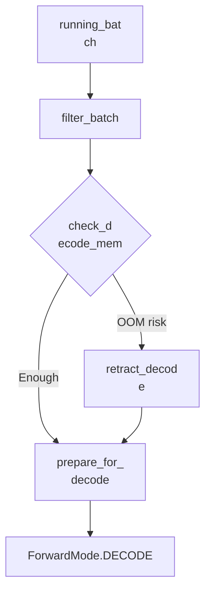
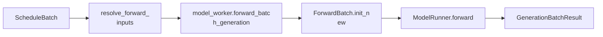

# 第 2 讲：Scheduler 调度核心

本讲�
��标：理解 SGLang 的 Scheduler 如何把
离散请求变成连续执行的 GPU batch�
�重点不是背完每个优化分支，而�
�抓住三个状态：`waiting_queue`、`last
_batch`、`running_batch`。

## 一句话总
览

Scheduler 每轮做同一件事：

1. �
��新请求。
2. 把新请求放进 `waiting
_queue`。
3. 优先尝试从 `waiting_queue`
 组一个新的 prefill batch。
4. 如果�
�有新的 prefill batch，就推进已有 `r
unning_batch` 做 decode。
5. forward 之后
更新请求状态，并把输出 token 送�
� detokenize。

```mermaid
flowchart TD
  A[
"request_receiver.recv_requests"] --> B["proc
ess_input_requests"]
  B --> C["waiting_queue
"]
  C --> D["get_next_batch_to_run"]
  D -->
 E{"能组新 prefill batch?"}
  E -->|"Yes"|
 F["get_new_batch_prefill"]
  E -->|"No"| G["
update_running_batch"]
  F --> H["run_batch"]

  G --> H
  H --> I["process_batch_result"]

  I --> J["output_streamer"]
  I --> K["last_
batch / running_batch 状态更新"]
```

## 
1. 三个核心状态

| 文件 | 类 / 函�
� | 重点代码段 |
|---|---|---|
| `python
/sglang/srt/managers/scheduler.py` | `Schedul
er.__init__()` | 初始化 scheduler 所需�
�件。 |
| `python/sglang/srt/managers/sched
uler.py` | `Scheduler.init_running_status()` 
| 初始化 `waiting_queue`、`running_batch`
、`last_batch` 等运行状态。 |

核心�
��段：

- `waiting_queue`：还没进入 GP
U prefill 的 `Req` 列表。
- `running_batc
h`：已经完成 prefill、正在逐 token d
ecode 的请求集合。
- `last_batch`：上
一轮刚跑完的 batch，用于把 prefill 
后还没结束的请求合并进 `running_ba
tch`。

```mermaid
stateDiagram-v2
  [*] -->
 WaitingQueue: TokenizedGenerateReqInput -> R
eq
  WaitingQueue --> PrefillBatch: get_new_b
atch_prefill
  PrefillBatch --> LastBatch: ru
n extend/prefill
  LastBatch --> RunningBatch
: merge after prefill
  RunningBatch --> Deco
deBatch: prepare_for_decode
  DecodeBatch -->
 RunningBatch: unfinished reqs stay
  DecodeB
atch --> Finished: finished reqs filtered
  R
unningBatch --> WaitingQueue: retract / preem
ption
```

## 2. 主循环：普通模式与 
overlap 模式

| 文件 | 函数 | 重点代
码段 |
|---|---|---|
| `python/sglang/srt/m
anagers/scheduler.py` | `Scheduler.run_event_
loop()` | 根据 overlap、MLX 等配置选�
�具体 event loop。 |
| `python/sglang/srt/
managers/scheduler.py` | `Scheduler.event_loo
p_normal()` | 普通循环：收请求、调�
��、forward、处理结果。 |
| `python/sg
lang/srt/managers/scheduler.py` | `Scheduler.
event_loop_overlap()` | overlap 循环：使�
�� `result_queue` 让 GPU forward 和 CPU 结
果处理重叠。 |

普通模式骨架：


```python
recv_reqs = self.request_receiver.r
ecv_requests()
self.process_input_requests(re
cv_reqs)
batch = self.get_next_batch_to_run()

if batch:
    result = self.run_batch(batch)

    self.process_batch_result(batch, result)

```

第一遍读源码时可以先看 `even
t_loop_normal()`，等主链通了再回来�
� `event_loop_overlap()`。

## 3. 输入请�
��如何进入等待队列

| 文件 | 函数
 | 重点代码段 |
|---|---|---|
| `python/
sglang/srt/managers/scheduler.py` | `Schedule
r.process_input_requests()` | 从 ZMQ 收到�
��对象按类型 dispatch，例如生成、e
mbedding、abort、flush cache。 |
| `python
/sglang/srt/managers/scheduler.py` | `Schedul
er.handle_generate_request()` | 把 `Tokenize
dGenerateReqInput` 转成内部 `Req`，填�
� sampling、priority、LoRA、grammar、多�
��态字段。 |
| `python/sglang/srt/manager
s/scheduler.py` | `Scheduler.init_req_max_new
_tokens()` | 计算并校验请求可生成 t
oken 数。 |
| `python/sglang/srt/managers/s
cheduler.py` | `Scheduler._add_request_to_que
ue()` | 真正加入 `waiting_queue`，必要
时处理 priority / queued limit。 |

```me
rmaid
flowchart LR
  A["TokenizedGenerateReqI
nput"] --> B["process_input_requests"]
  B --
> C["handle_generate_request"]
  C --> D["Req
"]
  D --> E["_add_request_to_queue"]
  E -->
 F["waiting_queue"]
```

这一段回答的�
�用户例子里的问题：**输入请求分
发在 `process_input_requests()`；生成请
求具体 dispatch 到 `handle_generate_reque
st()`；进入等待队列在 `_add_request_t
o_queue()`。**

## 4. `get_next_batch_to_run
()`：调度决策中心

| 文件 | 函数 /
 代码段 | 作用 |
|---|---|---|
| `python
/sglang/srt/managers/scheduler.py` | `Schedul
er.get_next_batch_to_run()` | 先合并上一
轮 prefill 结果，再尝试新 prefill，�
��后 fallback 到 decode。 |
| `python/sgla
ng/srt/managers/schedule_batch.py` | `Schedul
eBatch.merge_batch()` | 将 prefill 后未完
成的请求合并到 `running_batch`。 |
| 
`python/sglang/srt/managers/scheduler.py` | `
Scheduler.get_new_batch_prefill()` | 尝试�
� `waiting_queue` 组 prefill batch。 |
| `p
ython/sglang/srt/managers/scheduler.py` | `Sc
heduler.update_running_batch()` | 没有新 p
refill 时推进 decode batch。 |

```mermai
d
flowchart TD
  A["get_next_batch_to_run"] -
-> B["merge last_batch into running_batch"]
 
 B --> C["get_new_batch_prefill"]
  C --> D{"
new_batch exists?"}
  D -->|"Yes"| E["return 
prefill batch"]
  D -->|"No"| F{"running_batc
h non-empty?"}
  F -->|"Yes"| G["update_runni
ng_batch"]
  G --> H["return decode batch"]
 
 F -->|"No"| I["return None / idle"]
```

这
解释了 continuous batching 的核心：正
在 decode 的请求不会阻塞新请求 pre
fill；Scheduler 每轮都会尝试插入新�
�� prefill batch，再回到 decode。

## 5.
 Prefill：从 `waiting_queue` 选请求

| �
��件 | 函数 / 类 | 重点代码段 |
|---
|---|---|
| `python/sglang/srt/managers/sched
uler.py` | `Scheduler.get_new_batch_prefill()
` | prefill 入口，处理 grammar ready、�
��列状态和 wrapper 逻辑。 |
| `python/
sglang/srt/managers/scheduler.py` | `Schedule
r._get_new_batch_prefill_raw()` | prefill 选
请求的核心：算 prefix、创建 `Prefil
lAdder`、遍历 `waiting_queue`。 |
| `pyth
on/sglang/srt/managers/schedule_policy.py` | 
`SchedulePolicy.calc_priority()` | 根据 FCF
S、LPM、DFS weight、priority 等策略重�
��等待队列。 |
| `python/sglang/srt/mana
gers/schedule_policy.py` | `PrefillAdder.__in
it__()` | 初始化 token/KV/chunk 预算。 
|
| `python/sglang/srt/managers/schedule_poli
cy.py` | `PrefillAdder.add_one_req()` | 判�
�单个请求能否进入本轮 prefill。 |

| `python/sglang/srt/managers/schedule_batch.
py` | `ScheduleBatch.init_new()` | 用 `can_r
un_list` 创建 `ScheduleBatch`。 |
| `pytho
n/sglang/srt/managers/schedule_batch.py` | `S
cheduleBatch.prepare_for_extend()` | 设置 `
ForwardMode.EXTEND`，分配 prefill/extend K
V cache。 |

```mermaid
flowchart TD
  A["wa
iting_queue"] --> B["SchedulePolicy.calc_prio
rity"]
  B --> C["PrefillAdder"]
  C --> D{"a
dd_one_req(req)"}
  D -->|"CONTINUE"| E["can_
run_list append"]
  D -->|"NO_TOKEN"| F["stop
: KV/token budget full"]
  D -->|"OTHER"| G["
stop: policy/chunk/request limit"]
  E --> H[
"ScheduleBatch.init_new"]
  H --> I["prepare_
for_extend"]
  I --> J["ForwardMode.EXTEND"]

```

`PrefillAdder.add_one_req()` 是资源�
�束最集中的地方，重点看这些字�
�如何被消耗：

- `rem_total_tokens`
- `
cur_rem_tokens`
- `rem_input_tokens`
- `rem_c
hunk_tokens`
- `can_run_list`
- `preempt_list
`

## 6. `ScheduleBatch`：调度器的 batch
 容器

| 文件 | 类 / 函数 | 重点代�
��段 |
|---|---|---|
| `python/sglang/srt/ma
nagers/schedule_batch.py` | `class Req` | 单
个内部请求，保存 `origin_input_ids`�
�`output_ids`、`prefix_indices`、finish 状
态等。 |
| `python/sglang/srt/managers/sch
edule_batch.py` | `Req.init_next_round_input(
)` | prefill 前做 prefix match，计算本�
��实际需要处理的 suffix。 |
| `python
/sglang/srt/managers/schedule_batch.py` | `cl
ass ScheduleBatch` | Scheduler 层 batch，�
�存 `reqs`、pool、tree cache、forward mod
e。 |
| `python/sglang/srt/managers/schedule
_batch.py` | `ScheduleBatch.init_new()` | 从
 `Req` 列表构造新的 batch。 |
| `pytho
n/sglang/srt/managers/schedule_batch.py` | `S
cheduleBatch.prepare_for_extend()` | prefill/
extend 前准备 input ids、seq lens、KV sl
ot。 |
| `python/sglang/srt/managers/schedul
e_batch.py` | `ScheduleBatch.prepare_for_deco
de()` | decode 前为每个 running req 分�
�下一 token 的 KV slot。 |

`ScheduleBatc
h` 不是模型最终消费的 batch。模型
层真正消费的是下一讲会讲到的 `F
orwardBatch`。

## 7. Decode：推进 `runni
ng_batch`

| 文件 | 函数 | 重点代码�
� |
|---|---|---|
| `python/sglang/srt/manage
rs/scheduler.py` | `Scheduler.update_running_
batch()` | 过滤完成请求、检查 decode
 内存、必要时 retract。 |
| `python/sg
lang/srt/managers/schedule_batch.py` | `Sched
uleBatch.filter_batch()` | 移除 finished �
�被排除的请求。 |
| `python/sglang/srt
/managers/schedule_batch.py` | `ScheduleBatch
.check_decode_mem()` | 检查下一 decode st
ep 是否有足够 KV slot。 |
| `python/sgl
ang/srt/managers/schedule_batch.py` | `Schedu
leBatch.retract_decode()` | 内存不足时�
�回部分请求，释放 KV cache，放回�
�待队列。 |
| `python/sglang/srt/managers
/schedule_batch.py` | `ScheduleBatch.prepare_
for_decode()` | 设置 `ForwardMode.DECODE`�
�为每个请求分配新 token 的 KV slot�
� |



## 8. `run_batch()`：真正发起 forw
ard

| 文件 | 函数 / 代码段 | 作用 |

|---|---|---|
| `python/sglang/srt/managers/
scheduler.py` | `Scheduler.run_batch()` | Sch
eduler 调 worker forward 的总入口。 |
|
 `python/sglang/srt/managers/scheduler.py` | 
`resolve_forward_inputs(batch, self.future_ma
p)` 调用点 | 把前面准备的 future inp
uts 解析成 forward 可以消费的输入�
� |
| `python/sglang/srt/managers/scheduler.p
y` | `self.model_worker.forward_batch_generat
ion(batch, **kwargs)` 调用点 | 进入 `TpM
odelWorker -> ForwardBatch -> ModelRunner` �
�径。 |
| `python/sglang/srt/managers/tp_wo
rker.py` | `TpModelWorker.forward_batch_gener
ation()` | worker 侧真正执行模型 forwa
rd 和 sampling。 |



## 9. `proce
ss_batch_result()`：把 token 写回 `Req`


| 文件 | 函数 / 类 | 重点代码段 |
|
---|---|---|
| `python/sglang/srt/managers/sc
heduler.py` | `Scheduler.process_batch_result
()` | 根据 batch 类型把结果交给 resu
lt processor。 |
| `python/sglang/srt/manage
rs/scheduler_components/batch_result_processo
r.py` | `BatchResultProcessor.process_batch_r
esult_prefill()` | 处理 prefill 结果，�
�新 `Req.output_ids`、finish、cache。 |
|
 `python/sglang/srt/managers/scheduler_compon
ents/batch_result_processor.py` | `BatchResul
tProcessor.process_batch_result_decode()` | �
��理 decode 结果，追加 token 并判断�
��束。 |
| `python/sglang/srt/managers/sche
duler_components/batch_result_processor.py` |
 输出到 `output_streamer` 的调用点 | �
��可输出 token id 交给 Detokenizer。 |

| `python/sglang/srt/managers/scheduler_compo
nents/output_streamer.py` | `OutputStreamer` 
| 统一处理 token id 输出、streaming、
skip special token 等输出前逻辑。 |

p
refill 和 decode 都会更新 `Req.output_id
s` 与 finish 状态：

- prefill：处理 p
rompt extend 后采样出的第一个 token�
�
- decode：每轮追加一个或多个新 t
oken，然后判断请求是否结束。

## 
10. 第一遍读 Scheduler 时可以忽略什
么

先跳过：

- disaggregation prefill/d
ecode
- DLLM
- HiSparse
- pipeline parallel m
icrobatch
- speculative decoding 细节
- LoR
A overlap loading
- overlap schedule 的 stre
am 隔离细节

不要跳过：

- `Schedule
r.process_input_requests()`
- `Scheduler.hand
le_generate_request()`
- `Scheduler._add_requ
est_to_queue()`
- `Scheduler.get_next_batch_t
o_run()`
- `Scheduler.get_new_batch_prefill()
` / `_get_new_batch_prefill_raw()`
- `Schedul
er.update_running_batch()`
- `ScheduleBatch.p
repare_for_extend()`
- `ScheduleBatch.prepare
_for_decode()`
- `Scheduler.run_batch()`
- `S
cheduler.process_batch_result()`

## 这一�
�的阅读任务

| 顺序 | 文件 | 函数 
/ 代码段 |
|---:|---|---|
| 1 | `python/sg
lang/srt/managers/scheduler.py` | `event_loop
_normal()` |
| 2 | `python/sglang/srt/manager
s/scheduler.py` | `process_input_requests()`�
��`handle_generate_request()`、`_add_request
_to_queue()` |
| 3 | `python/sglang/srt/manag
ers/scheduler.py` | `get_next_batch_to_run()`
 |
| 4 | `python/sglang/srt/managers/schedule
r.py` | `get_new_batch_prefill()`、`_get_new
_batch_prefill_raw()` |
| 5 | `python/sglang/
srt/managers/schedule_policy.py` | `ScheduleP
olicy.calc_priority()`、`PrefillAdder.add_on
e_req()` |
| 6 | `python/sglang/srt/managers/
schedule_batch.py` | `Req.init_next_round_inp
ut()`、`ScheduleBatch.prepare_for_extend()` 
|
| 7 | `python/sglang/srt/managers/scheduler
.py` | `update_running_batch()` |
| 8 | `pyth
on/sglang/srt/managers/schedule_batch.py` | `
check_decode_mem()`、`retract_decode()`、`p
repare_for_decode()` |
| 9 | `python/sglang/s
rt/managers/scheduler.py` | `run_batch()`、`
process_batch_result()` |

读完后，用自
己的话回答：

- 为什么 Scheduler 会
优先尝试新 prefill，再做 decode？
- 
`waiting_queue` 里的请求什么时候进�
� `running_batch`？
- `PrefillAdder.add_one_
req()` 主要在检查哪些资源？
- `prep
are_for_extend()` 和 `prepare_for_decode()` 
的差别是什么？
- decode 内存不够�
�，SGLang 怎么避免直接 OOM？

## 下�
��讲预告

下一讲读 KV cache 与 Radix 
Cache。Scheduler 为什么能高效插入新
请求，很大一部分原因来自 prefix c
ache 和 KV cache allocator 的配合。


