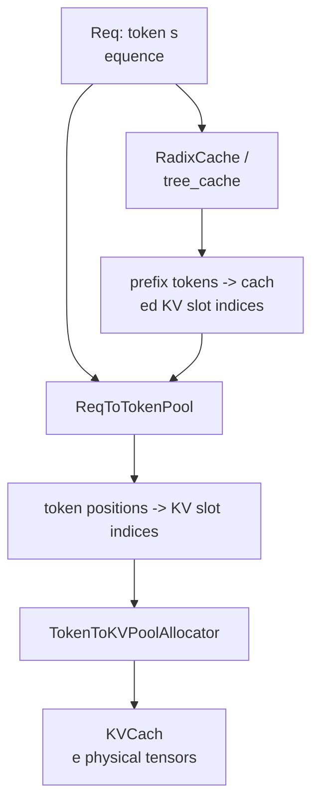
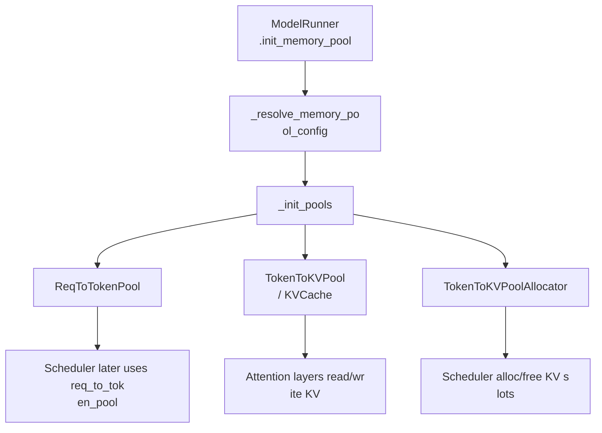
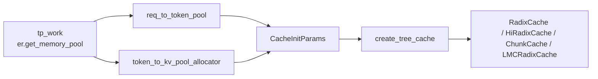
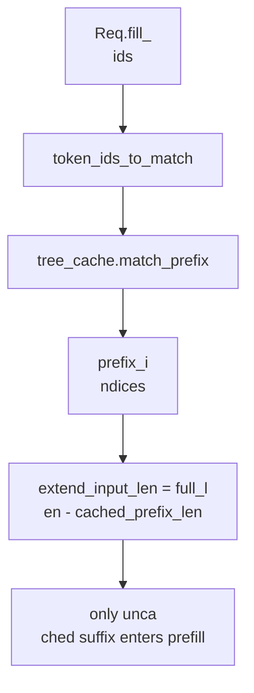
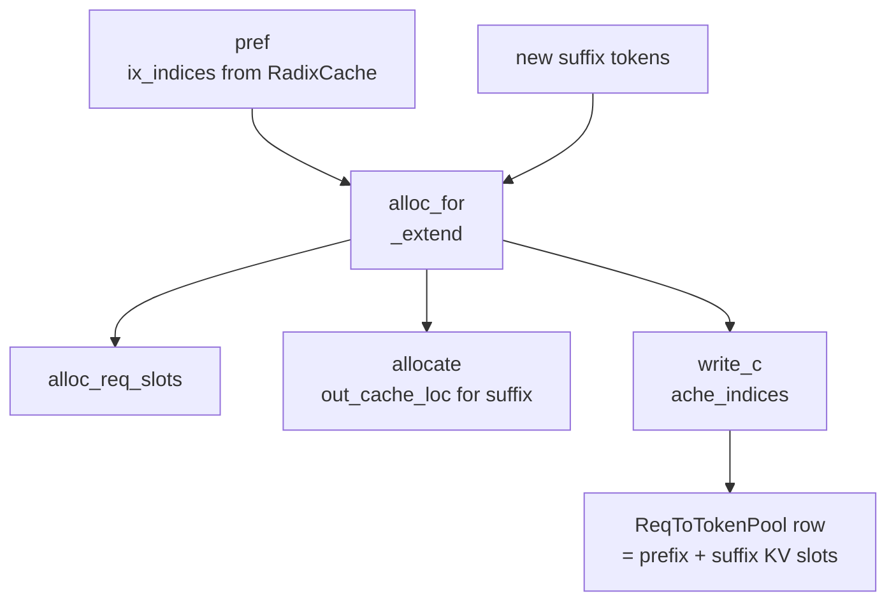
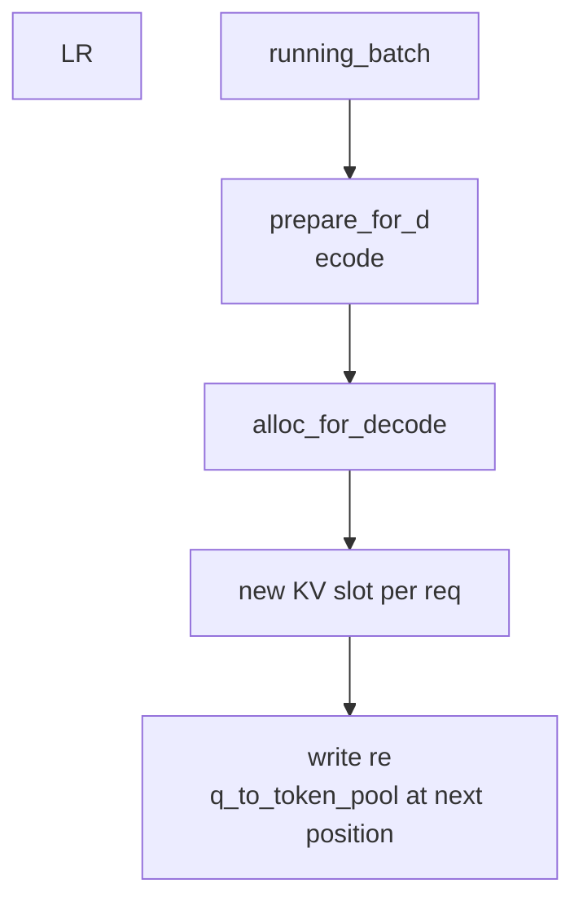
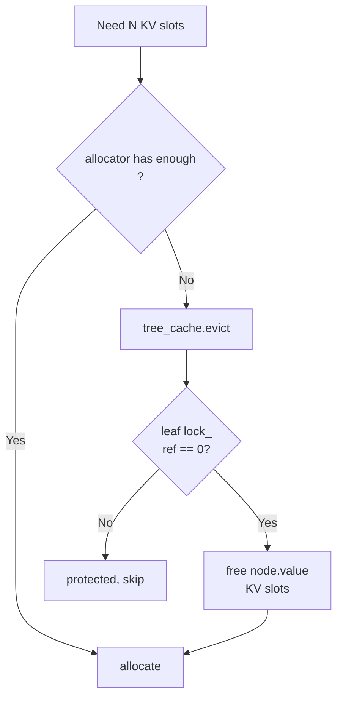

# 第 3 讲：KV Cache、Radix Cache 与 HiCa
che

本讲目标：理解 SGLang 如何管�
� KV cache，为什么 prefix cache 能减少
 prefill 成本，以及 Scheduler 为什么�
��是在调度前后操作 `tree_cache`、`re
q_to_token_pool`、`token_to_kv_pool_allocato
r`。

## 一句话总览

SGLang 的 cache �
��统可以分成三层：

- `KVCache`：真
正保存每层 attention 的 K/V tensor。
-
 `ReqToTokenPool`：记录“某个请求的�
�� i 个 token 对应哪个 KV slot”。
- `
RadixCache / tree_cache`：用 token 前缀�
�为 key，记录可复用的 KV slot 序列�
��



一句更
直白的话：**KVCache 放数据，ReqToTok
enPool 记地址，RadixCache 负责查前缀
能不能复用。**

## 1. Memory Pool：物
理 KV 存储和地址表

| 文件 | 类 / �
��数 | 重点代码段 |
|---|---|---|
| `py
thon/sglang/srt/mem_cache/memory_pool.py` | `
class ReqToTokenPool` | 保存 `req_to_token[
req_pool_idx, token_position] = kv_slot_index
`。 |
| `python/sglang/srt/mem_cache/memory_
pool.py` | `ReqToTokenPool.alloc()` | 给一�
�� `Req` 分配 request slot，也就是 `req
.req_pool_idx`。 |
| `python/sglang/srt/mem_
cache/memory_pool.py` | `ReqToTokenPool.write
()` | 把 token position 到 KV slot 的映�
�写进二维表。 |
| `python/sglang/srt/me
m_cache/memory_pool.py` | `class KVCache` | K
V pool 抽象基类，定义 `get_key_buffer(
)`、`get_value_buffer()`、`set_kv_buffer()`
。 |
| `python/sglang/srt/mem_cache/memory_p
ool.py` | `class MHATokenToKVPool` | 普通 M
HA/GQA 模型常见的 KV tensor 实现。 |

| `python/sglang/srt/mem_cache/memory_pool.py
` | `MHATokenToKVPool.set_kv_buffer()` | atte
ntion backend 写入某层新 K/V 的位置�
� |

核心关系：

```python
req_to_token[
req_pool_idx, token_position] = kv_slot_index

```

```mermaid
flowchart TD
  A["Req rid=ab
c"] --> B["req_pool_idx = 7"]
  B --> C["req_
to_token[7, 0] = 101"]
  B --> D["req_to_toke
n[7, 1] = 102"]
  B --> E["req_to_token[7, 2]
 = 205"]
  C --> F["KVCache slot 101"]
  D --
> G["KVCache slot 102"]
  E --> H["KVCache sl
ot 205"]
```

## 2. ModelRunner 初始化 cac
he

| 文件 | 类 / 函数 | 重点代码段
 |
|---|---|---|
| `python/sglang/srt/model_e
xecutor/model_runner_kv_cache_mixin.py` | `Mo
delRunnerKVCacheMixin.init_memory_pool()` | c
ache 初始化总入口，计算可用 token 
容量并调用 `_init_pools()`。 |
| `pytho
n/sglang/srt/model_executor/model_runner_kv_c
ache_mixin.py` | `ModelRunnerKVCacheMixin._in
it_pools()` | 初始化 `req_to_token_pool`�
�`token_to_kv_pool`、`token_to_kv_pool_alloc
ator`。 |
| `python/sglang/srt/model_executo
r/model_runner_kv_cache_mixin.py` | `_resolve
_memory_pool_config()` | 根据模型、dtype
、page size、SWA/MLA/Mamba 等配置决定 
pool 形态。 |
| `python/sglang/srt/model_e
xecutor/model_runner_kv_cache_mixin.py` | `_a
pply_memory_pool_config()` | 把 memory pool 
config 落到 `ModelRunner` 实例字段上�
� |



第一次读源码只要知道：
allocator 管理 KV slot 的空闲、分配�
�释放、evict；attention backend 通过 KV
 pool 读写真实 K/V tensor。

## 3. `buil
d_kv_cache()`：把 pool 和 tree cache 组�
�起来

| 文件 | 函数 / 类 | 重点代�
��段 |
|---|---|---|
| `python/sglang/srt/me
m_cache/kv_cache_builder.py` | `build_kv_cach
e()` | 从 worker 取 memory pool，构造 `C
acheInitParams`，调用 `create_tree_cache()
`。 |
| `python/sglang/srt/mem_cache/kv_cach
e_builder.py` | `KVCacheBuildResult` | 返回
 `req_to_token_pool`、`token_to_kv_pool_allo
cator`、`tree_cache` 等结果。 |
| `pytho
n/sglang/srt/mem_cache/registry.py` | `TreeCa
cheBuildContext` | tree cache 创建所需上
下文。 |
| `python/sglang/srt/mem_cache/re
gistry.py` | `create_tree_cache()` | tree cac
he 创建总入口。 |
| `python/sglang/srt/
mem_cache/registry.py` | `default_radix_cache
_factory()` | 默认选择 `RadixCache`、`Ch
unkCache`、HiCache、SWA/Mamba cache 等实�
��。 |



## 4. RadixCache：prefix -> KV slot in
dices

| 文件 | 类 / 函数 | 重点代码
段 |
|---|---|---|
| `python/sglang/srt/mem_
cache/radix_cache.py` | `class RadixKey` | pr
efix key，包含 token ids 和 `extra_key`�
� |
| `python/sglang/srt/mem_cache/radix_cach
e.py` | `RadixKey.match()` | 计算两个 key
 的公共前缀长度。 |
| `python/sglang/
srt/mem_cache/radix_cache.py` | `class TreeNo
de` | radix tree 节点，保存 `key`、`val
ue`、`children`、`lock_ref` 等。 |
| `pyt
hon/sglang/srt/mem_cache/radix_cache.py` | `c
lass RadixCache` | 压缩前缀树主体。 |

| `python/sglang/srt/mem_cache/radix_cache.p
y` | `RadixCache.match_prefix()` | 查找可�
��用 prefix，返回 `MatchResult`。 |
| `p
ython/sglang/srt/mem_cache/radix_cache.py` | 
`RadixCache.insert()` | 将 token prefix 和 
KV slots 插入 radix tree。 |
| `python/sgl
ang/srt/mem_cache/radix_cache.py` | `RadixCac
he._match_prefix_helper()` / `_split_node()` 
| radix tree 查找和节点分裂的核心�
�部逻辑。 |

```mermaid
flowchart TD
  R[
"root"]
  R --> A["System prompt tokens"]
  A
 --> B["User A prefix"]
  A --> C["User B pre
fix"]
  B --> D["KV slots for branch A"]
  C 
--> E["KV slots for branch B"]
```

`RadixKey
.extra_key` 很重要：它可以隔离不同
 LoRA、cache salt 或其他不应该共享 K
V 的请求。

## 5. Prefix match：请求�
�入 prefill 前先查 cache

| 文件 | 类 
/ 函数 | 重点代码段 |
|---|---|---|
| 
`python/sglang/srt/managers/schedule_batch.py
` | `class Req` | 保存 `prefix_indices`、`
last_node`、`host_hit_length`、`cache_prote
cted_len` 等 prefix match 结果。 |
| `pyt
hon/sglang/srt/managers/schedule_batch.py` | 
`Req.init_next_round_input()` | 构造 `fill_
ids`，调用 `tree_cache.match_prefix(...)`�
��计算 `extend_input_len`。 |
| `python/sg
lang/srt/managers/schedule_batch.py` | `Req._
compute_max_prefix_len()` | 限制 prefix mat
ch 的最大长度，通常不会匹配最后
一个待生成位置。 |
| `python/sglang/s
rt/mem_cache/radix_cache.py` | `RadixCache.ma
tch_prefix()` | 返回 `MatchResult`，其中
 `device_indices` 是可复用 KV slots。 |

| `python/sglang/srt/managers/schedule_policy
.py` | `match_prefix_for_req()` | 调度策�
�里批量计算 prefix match 的辅助函数
。 |



关键直�
�：`prefix_indices` 是“已经算过、可
以复用的 KV slot 序列”；prefill 只�
��要处理未命中的 suffix。

## 6. Pref
ill 分配：只给未命中的 suffix 分配
 KV

| 文件 | 函数 | 重点代码段 |
|-
--|---|---|
| `python/sglang/srt/managers/sch
eduler.py` | `Scheduler._get_new_batch_prefil
l_raw()` | 调 `req.init_next_round_input(sel
f.tree_cache)`，决定每个请求还需 pre
fill 多少 token。 |
| `python/sglang/srt/m
anagers/schedule_batch.py` | `ScheduleBatch.p
repare_for_extend()` | 计算 `input_ids = fi
ll_ids[len(prefix_indices):]`、`extend_lens`
、`prefix_lens`。 |
| `python/sglang/srt/me
m_cache/common.py` | `alloc_req_slots()` | �
�请求分配 `req_pool_idx`。 |
| `python/s
glang/srt/mem_cache/common.py` | `alloc_for_e
xtend()` | 为未命中 suffix 分配 KV slot
s，并把 prefix + suffix 写入 req table�
� |
| `python/sglang/srt/mem_cache/common.py`
 | `write_cache_indices()` | 写 `req_to_toke
n_pool`：把 token 位置映射到 KV slots�
�� |
| `python/sglang/srt/mem_cache/common.py
` | `alloc_token_slots()` / `alloc_paged_toke
n_slots_extend()` | 普通或 paged KV slot �
��配。 |



## 7. Decod
e 分配：每轮每个请求追加一个 KV 
slot

| 文件 | 函数 | 重点代码段 |
|
---|---|---|
| `python/sglang/srt/managers/sc
hedule_batch.py` | `ScheduleBatch.prepare_for
_decode()` | decode 前准备 `forward_mode`�
��`seq_lens`、`out_cache_loc`。 |
| `python
/sglang/srt/mem_cache/common.py` | `alloc_for
_decode()` | 按 batch size 分配新 token K
V slots，并写入 req table。 |
| `python/
sglang/srt/mem_cache/common.py` | `alloc_page
d_token_slots_decode()` | paged KV cache 下 
decode slot 分配。 |



decod
e 阶段不再做大段 prefix match；每轮
只为每个 running request 的新 token 分
配一个位置。

## 8. Forward 时 attenti
on 怎么找到历史 KV

| 文件 | 类 / �
�数 | 重点代码段 |
|---|---|---|
| `pyt
hon/sglang/srt/model_executor/forward_batch_i
nfo.py` | `class ForwardBatch` | 保存 `req_
pool_indices`、`seq_lens`、`out_cache_loc`�
�� |
| `python/sglang/srt/model_executor/forw
ard_batch_info.py` | `ForwardBatch.init_new()
` | 从 `ScheduleBatch` 拷贝这些字段给
模型前向。 |
| `python/sglang/srt/layers
/attention/torch_flex_backend.py` | `TorchFle
xAttnBackend.forward_decode()` / `forward_ext
end()` | 示例 backend：用 pool 和 batch 
metadata 读写 KV。 |
| `python/sglang/srt/
mem_cache/memory_pool.py` | `KVCache.get_key_
buffer()` / `get_value_buffer()` | attention 
backend 读取真实 K/V tensor。 |

```merm
aid
flowchart TD
  A["ForwardBatch.req_pool_i
ndices"] --> B["ReqToTokenPool"]
  C["Forward
Batch.seq_lens"] --> B
  B --> D["token posit
ions -> KV slot indices"]
  D --> E["Attentio
n backend"]
  E --> F["read old KV / write ne
w KV"]
```

模型层不需要知道 Radix tr
ee 怎么长；它只需要 `ForwardBatch` �
� KV pool 暴露出的 slot 映射。

## 9. 
请求结束或中间暂停时，KV 如何回
到 RadixCache

| 文件 | 函数 | 重点代
码段 |
|---|---|---|
| `python/sglang/srt/m
em_cache/common.py` | `maybe_cache_unfinished
_req()` | prefill 后请求未完成时，按
条件调用 tree cache 缓存。 |
| `python
/sglang/srt/mem_cache/radix_cache.py` | `Radi
xCache.cache_unfinished_req()` | 把未完成
请求当前 prefix 插入 radix tree，并�
�新 `prefix_indices` / lock。 |
| `python/s
glang/srt/mem_cache/common.py` | `release_kv_
cache()` | 请求完成、撤回或释放时�
��决定插入 tree cache 还是直接释放�
�� |
| `python/sglang/srt/mem_cache/radix_cac
he.py` | `RadixCache.cache_finished_req()` | 
已完成请求的 KV 插入 radix tree 或�
�放。 |
| `python/sglang/srt/mem_cache/radi
x_cache.py` | `RadixCache.insert()` | 具体�
��入 radix tree 的实现。 |

```mermaid
f
lowchart TD
  A["Req finished or prefill comp
leted"] --> B{"insert into RadixCache?"}
  B 
-->|"Yes"| C["RadixCache.insert"]
  B -->|"No
"| D["free KV slots"]
  C --> E["tree owns re
usable KV slots"]
  C --> F["free duplicates 
/ tails"]
```

## 10. Eviction：KV 不够时
从 tree cache 淘汰

| 文件 | 函数 | �
�点代码段 |
|---|---|---|
| `python/sglan
g/srt/mem_cache/common.py` | `evict_from_tree
_cache()` | allocator 空间不足时调用 t
ree cache eviction。 |
| `python/sglang/srt/
mem_cache/radix_cache.py` | `RadixCache.evict
()` | 从可淘汰 leaves 中按策略释放 
KV slots。 |
| `python/sglang/srt/mem_cache/
radix_cache.py` | `RadixCache.inc_lock_ref()`
 | 请求使用某个 prefix node 时加锁�
�防止被 evict。 |
| `python/sglang/srt/me
m_cache/radix_cache.py` | `RadixCache.dec_loc
k_ref()` | 请求释放或迁移时解锁。 
|
| `python/sglang/srt/mem_cache/radix_cache.
py` | `RadixCache._delete_leaf()` / `_update_
leaf_status()` | leaf 删除和 evictable 状
态维护。 |



`lock_ref > 0` 的节点不�
��淘汰，因为它们正在被请求引用�
��

## 11. HiCache：把 RadixCache 扩展到
 host/storage

| 文件 | 类 / 函数 | 重�
��代码段 |
|---|---|---|
| `python/sglang/
srt/mem_cache/registry.py` | `create_tree_cac
he()` | HiCache 也是从这个入口创建�
� |
| `python/sglang/srt/mem_cache/registry.p
y` | `default_radix_cache_factory()` | 根据
 `enable_hierarchical_cache` 等配置选择 
HiCache 实现。 |
| `python/sglang/srt/mem_
cache/hiradix_cache.py` | `HiRadixCache` 相�
��类/方法 | 管理 device + host/storage �
��级命中。 |
| `python/sglang/srt/mem_cac
he/hybrid_cache/hybrid_cache_controller.py` |
 hybrid cache controller 相关类/方法 | �
��一管理 hybrid / hierarchical cache 行�
�。 |
| `python/sglang/srt/managers/schedule
_policy.py` | `PrefillAdder.add_one_req()` | 
host hit 后可能触发 load-back 预算与�
��定逻辑。 |
| `python/sglang/srt/manager
s/schedule_batch.py` | `ScheduleBatch.prepare
_for_extend()` | 统计 device/host/storage c
ached tokens。 |

HiCache 让 `MatchResult` 
多了这些意义：

- `device_indices`：G
PU 上已经可用的 KV。
- `host_hit_lengt
h`：host/cache storage 命中的长度。
- 
`best_match_node`：可用于发起 host-to-d
evice load-back 的节点。

第一次读可
以把 HiCache 理解为：RadixCache 的 val
ue 不只可能在 GPU，也可能在 host/st
orage；命中后需要搬回 GPU 才能继�
� forward。

## 12. 和 Scheduler 的连接�
��

| 位置 | 具体源码定位 | 做什么
 |
|---|---|---|
| `req.init_next_round_input
(self.tree_cache)` | `python/sglang/srt/manag
ers/schedule_batch.py` / `Req.init_next_round
_input()` | 对请求做 prefix match，算�
�还要 prefill 的 suffix。 |
| `PrefillAdd
er.add_one_req(req)` | `python/sglang/srt/man
agers/schedule_policy.py` / `PrefillAdder.add
_one_req()` | 检查 KV/token 预算，锁住
命中的 prefix node。 |
| `ScheduleBatch.p
repare_for_extend()` | `python/sglang/srt/man
agers/schedule_batch.py` / `ScheduleBatch.pre
pare_for_extend()` | 为 prefill suffix 分�
� KV slot。 |
| `ScheduleBatch.prepare_for_d
ecode()` | `python/sglang/srt/managers/schedu
le_batch.py` / `ScheduleBatch.prepare_for_dec
ode()` | 为每个 decode step 分配新 KV s
lot。 |
| `process_batch_result_prefill()` |
 `python/sglang/srt/managers/scheduler_compon
ents/batch_result_processor.py` / `BatchResul
tProcessor.process_batch_result_prefill()` | 
prefill 后把未完成请求缓存起来。 
|
| `release_kv_cache()` | `python/sglang/srt
/mem_cache/common.py` / `release_kv_cache()` 
| 请求完成或撤回时释放/插入 KV。
 |
| `evict_from_tree_cache()` | `python/sgla
ng/srt/mem_cache/common.py` / `evict_from_tre
e_cache()` | 空间不足时淘汰可复用�
�未锁定的 cache。 |

## 这一讲的阅�
��任务

| 顺序 | 文件 | 函数 / 代码
段 |
|---:|---|---|
| 1 | `python/sglang/srt
/mem_cache/memory_pool.py` | `ReqToTokenPool`
、`ReqToTokenPool.alloc()`、`KVCache.set_kv
_buffer()` |
| 2 | `python/sglang/srt/model_e
xecutor/model_runner_kv_cache_mixin.py` | `in
it_memory_pool()`、`_init_pools()` |
| 3 | `
python/sglang/srt/mem_cache/kv_cache_builder.
py` | `build_kv_cache()`、`KVCacheBuildResul
t` |
| 4 | `python/sglang/srt/mem_cache/regis
try.py` | `create_tree_cache()`、`default_ra
dix_cache_factory()` |
| 5 | `python/sglang/s
rt/mem_cache/radix_cache.py` | `RadixKey`、`
TreeNode`、`RadixCache.match_prefix()`、`in
sert()` |
| 6 | `python/sglang/srt/managers/s
chedule_batch.py` | `Req.init_next_round_inpu
t()`、`ScheduleBatch.prepare_for_extend()` |

| 7 | `python/sglang/srt/mem_cache/common.py
` | `alloc_for_extend()`、`write_cache_indic
es()`、`alloc_for_decode()` |
| 8 | `python/
sglang/srt/mem_cache/radix_cache.py` | `cache
_unfinished_req()`、`cache_finished_req()`�
�`evict()` |
| 9 | `python/sglang/srt/mem_cac
he/radix_cache.py` | `inc_lock_ref()`、`dec_
lock_ref()` |

读完后，用自己的话回
答：

- `ReqToTokenPool` 和 `TokenToKVPool
Allocator` 分别管什么？
- `RadixCache.m
atch_prefix()` 返回的 `prefix_indices` 是
什么？
- 为什么 `prepare_for_extend()` 
只需要处理 `fill_ids[len(prefix_indices)
:]`？
- decode 阶段为什么每轮只分�
�一个新 KV slot？
- `lock_ref` 为什么�
��防止正在使用的 prefix 被 evict？
-
 HiCache 比普通 RadixCache 多了什么？


## 下一讲预告

下一讲进入 `ModelR
unner 与 attention backend`：看 `ForwardBa
tch` 如何被模型层消费，attention bac
kend 如何使用 `ReqToTokenPool` 读取历�
�� KV，并把新 token 的 KV 写进 cache�
�


