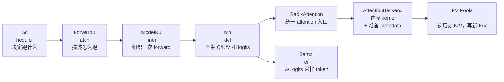

# 第 4 讲：ModelRunner 与 Attention Backe
nd

这一讲接在第 2 讲的 `ScheduleBatc
h` 和第 3 讲的 KV cache 之后：Schedule
r 已经决定“下一批跑什么”，KV c
ache 已经决定“token 存在哪里”，�
��下来就要进入真正的模型前向计�
��。

本讲目标：

- 看懂 `ScheduleBat
ch -> ForwardBatch` 这个边界为什么存�
��。
- 看懂 `ModelRunner.forward()` 如何
根据 `ForwardMode` 分发到 decode / exten
d。
- 看懂模型层里的 `RadixAttention`
 如何通过 `ForwardContext` 找到当前 a
ttention backend。
- 看懂 attention backen
d 如何读 `req_to_token_pool`、写 `token_
to_kv_pool`，并把输出交回模型。

--
-

## 0. 一张总图

```mermaid
flowchart T
D
  A["Scheduler<br/>产出 ScheduleBatch"] -
-> B["TpModelWorker.forward_batch_generation"
]
  B --> C["ForwardBatch.init_new<br/>CPU �
�度状态 -> GPU 前向张量"]
  C --> D["M
odelRunner.forward"]
  D --> E["_forward_raw<
br/>发布 ForwardContext"]
  E --> F{"Forwar
dMode"}
  F -->|DECODE| G["forward_decode"]
 
 F -->|EXTEND / MIXED / DRAFT_EXTEND| H["forw
ard_extend"]
  G --> I["attn_backend.init_for
ward_metadata"]
  H --> I
  I --> J["model.fo
rward(input_ids, positions, forward_batch)"]

  J --> K["LlamaModel / DecoderLayer / SelfAt
tention"]
  K --> L["RadixAttention.forward"]

  L --> M["get_attn_backend().forward"]
  M 
--> N["forward_decode / forward_extend kernel
 path"]
  N --> O["token_to_kv_pool.set_kv_bu
ffer<br/>写入新 K/V"]
  N --> P["req_to_to
ken_pool.req_to_token<br/>读取历史 token 
-> KV 位置"]
  P --> Q["attention output"]

  O --> Q
  Q --> R["logits"]
  R --> S["Mode
lRunner.sample<br/>采样 next_token_ids"]
``
`

一句话版：

> Scheduler 决定 batch�
��`ForwardBatch` 把 batch 变成模型前向
需要的张量；`ModelRunner` 负责分发�
��上下文；模型层只算 Q/K/V；attenti
on backend 负责根据 KV cache metadata 跑
真正的 attention kernel。

---

## 1. 关
键文件跳转表

| 主题 | 文件 | 具�
�定位 |
|---|---|---|
| worker 入口 | `py
thon/sglang/srt/managers/tp_worker.py` | `TpM
odelWorker.forward_batch_generation()` |
| �
�向 batch 数据结构 | `python/sglang/srt/
model_executor/forward_batch_info.py` | `Forw
ardMode`、`ForwardBatch.init_new()`、`compu
te_position()`、`compute_position_torch()` |

| 模型执行器 | `python/sglang/srt/model
_executor/model_runner.py` | `ModelRunner.for
ward()`、`_forward_raw()`、`forward_decode(
)`、`forward_extend()`、`sample()` |
| 前�
��上下文 | `python/sglang/srt/model_execut
or/forward_context.py` | `ForwardContext`、`
forward_context()`、`get_attn_backend()`、`
get_token_to_kv_pool()`、`get_req_to_token_p
ool()` |
| attention 抽象接口 | `python/s
glang/srt/layers/attention/base_attn_backend.
py` | `AttentionBackend.forward()`、`forward
_decode()`、`forward_extend()` |
| attention
 层入口 | `python/sglang/srt/layers/radix_
attention.py` | `RadixAttention.forward()`、
`unified_attention_with_output()` |
| 一个�
��读 backend | `python/sglang/srt/layers/att
ention/torch_flex_backend.py` | `TorchFlexAtt
nBackend.init_forward_metadata()`、`forward_
extend()`、`forward_decode()` |
| Llama 模�
��示例 | `python/sglang/srt/models/llama.py
` | `LlamaForCausalLM.forward()`、`LlamaMode
l.forward()`、`LlamaAttention.forward()` |


---

## 2. 为什么需要 `ForwardBatch`

�
� SGLang 里有一个非常重要的分层：


```mermaid
flowchart LR
  A["ScheduleBatch<
br/>Scheduler 视角"] --> B["ForwardBatch<br
/>ModelRunner 视角"]

  A1["请求对象 re
qs"] --> A
  A2["waiting/running batch"] --> 
A
  A3["prefix_lens / extend_lens"] --> A
  A
4["cache allocation result"] --> A

  B --> B
1["input_ids"]
  B --> B2["positions"]
  B --
> B3["req_pool_indices"]
  B --> B4["seq_lens
"]
  B --> B5["out_cache_loc"]
  B --> B6["sa
mpling_info / spec_info / lora_ids"]
```

源
码在 `forward_batch_info.py` 开头已经�
�接点明了这个关系：

- `ScheduleBatc
h` 属于 Scheduler，更多是 CPU 侧的调
度状态。
- `ForwardBatch` 属于 ModelRun
ner，更多是 GPU 前向需要的低层张�
��。
- `ForwardBatch.init_new()` 是两者�
�间的转换边界。

你可以把它理解
成：

> Scheduler 排好队之后，还不�
��直接喂给模型；必须打包成模型�
��attention backend、sampler 都能共同理
解的一张“前向执行单”。

---

##
 3. `ForwardBatch` 里最值得记的字段


先不要陷入所有字段。读 SGLang 前�
��路径时，优先记住这几个：

| 字
段 | 含义 | 谁最关心 |
|---|---|---|
|
 `forward_mode` | 当前是 prefill/extend、
decode、mixed、idle、spec verify 等哪种
前向 | `ModelRunner`、attention backend |

| `input_ids` | 本轮真正送入模型的 t
oken | 模型 embedding |
| `positions` | RoP
E / positional embedding 需要的位置 | �
�型 attention |
| `req_pool_indices` | 每�
�请求在 `req_to_token_pool` 里的行号 |
 attention backend |
| `seq_lens` | 每个请
求当前总长度 | attention backend、samp
ler |
| `out_cache_loc` | 本轮新 token 的
 K/V 应该写到 `token_to_kv_pool` 的哪�
�槽位 | attention backend |
| `extend_prefi
x_lens` | extend/prefill 时，每个请求�
�有 prefix 长度 | attention backend |
| `e
xtend_seq_lens` | extend/prefill 时，每个
请求本轮扩展 token 数 | attention back
end |
| `sampling_info` | temperature、top_p
、grammar 等采样参数 | sampler |
| `spe
c_info` | speculative decoding 相关 metadat
a | spec 路径、attention backend |

这几
个字段刚好把前三讲串起来：

```m
ermaid
flowchart TD
  A["第 2 讲 Scheduler"
] --> B["forward_mode / seq_lens / extend_len
s"]
  C["第 3 讲 KV cache"] --> D["req_pool
_indices / out_cache_loc"]
  B --> E["Forward
Batch"]
  D --> E
  E --> F["第 4 讲 ModelR
unner + AttentionBackend"]
```

---

## 4. `F
orwardBatch.init_new()`：从调度状态变�
��前向张量

入口在 `TpModelWorker.forw
ard_batch_generation()`：

```mermaid
sequen
ceDiagram
  participant S as Scheduler
  part
icipant W as TpModelWorker
  participant F as
 ForwardBatch
  participant M as ModelRunner


  S->>W: ScheduleBatch
  W->>F: ForwardBatch
.init_new(batch, model_runner)
  F-->>W: forw
ard_batch
  W->>M: model_runner.forward(forwa
rd_batch)
```

`ForwardBatch.init_new()` 做�
��事情可以分成四类：

1. **拷贝调
度结果**
   - `forward_mode`
   - `input_i
ds`
   - `req_pool_indices`
   - `seq_lens`
 
  - `out_cache_loc`

2. **准备 extend/decod
e 差异字段**
   - decode：通常每个�
�求只前进一个 token。
   - extend：�
�个请求可能一次处理多个 suffix tok
en，所以需要 `extend_prefix_lens`、`ext
end_seq_lens`、`extend_start_loc`。

3. **�
��算 positions**
   - decode：`positions = 
seq_lens - 1`，并做 clamp。
   - extend�
�调用 `compute_position()`，把每个请�
�的 prefix 长度和 extend 长度展开成 
token 级 position。

4. **挂载额外能�
� metadata**
   - LoRA：`lora_ids`
   - spec
ulative decoding：`spec_info`
   - multimoda
l：`mm_inputs`
   - dLLM：特殊 position �
��辑
   - logprob / grammar / sampling：采
样相关参数

### extend 的 position 例�
��

假设一个 batch 有两个请求：

| 
请求 | prefix_len | extend_len | positions 
|
|---|---:|---:|---|
| req A | 5 | 3 | `[5, 
6, 7]` |
| req B | 10 | 2 | `[10, 11]` |

那
么拼成一个扁平 token batch：

```text

input_ids:  [A5, A6, A7, B10, B11]
positions
:  [5,  6,  7,  10,  11]
```

这就是为什
么 extend 路径里不只是 batch size，�
�是还要关心 `extend_num_tokens`。

---


## 5. `ModelRunner.forward()`：真正的模
型执行总控

`ModelRunner.forward()` 本�
��更像一个外壳，负责 profiling、exp
ert recorder、debugger 等外围逻辑。真
正的分发在 `_forward_raw()`。

```merma
id
flowchart TD
  A["ModelRunner.forward"] --
> B["_forward_raw"]
  B --> C["发布 Forward
Context(attn_backend=self.attn_backend)"]
  C
 --> D{"能否 replay CUDA graph?"}
  D -->|y
es| E["graph_runner.replay"]
  D -->|no| F{"f
orward_mode"}
  F -->|decode| G["forward_deco
de"]
  F -->|extend / draft_extend| H["forwar
d_extend"]
  F -->|split_prefill| I["forward_
split_prefill"]
  F -->|idle| J["forward_idle
"]
```

这里最关键的是两个动作：


### 5.1 发布 `ForwardContext`

`_forward_r
aw()` 会把当前 `attn_backend` 放进 `For
wardContext`。之后模型深处的 attentio
n layer 不需要显式传 backend，只要�
�用：

```python
get_attn_backend()
```

�
�能拿到本轮 forward 应该使用的 back
end。

这是一种“动态上下文”设�
��：模型层只关心“我要算 attention
”，不用关心这次到底是 FlashInfer�
��Triton、Torch Flex、MLA、DSA 还是 PDmu
x 路径。

### 5.2 根据 `ForwardMode` 分
发

`ForwardMode` 是这一讲的核心开�
�：

| mode | 典型含义 | 路径 |
|---|-
--|---|
| `DECODE` | 每个请求生成下一
个 token | `forward_decode()` |
| `EXTEND` |
 prefill 或处理一段新 token | `forward_
extend()` |
| `MIXED` | 混合 prefill/decode
，某些 backend 特化支持 | 通常走 ex
tend 类路径 |
| `TARGET_VERIFY` | speculat
ive decoding verify | decode 类路径 |
| `D
RAFT_EXTEND` | speculative decoding draft | e
xtend 类路径 |
| `DLLM_EXTEND` | diffusion
 LLM 特殊 extend | dLLM 分支 |
| `IDLE` |
 空跑/同步占位 | `forward_idle()` |

--
-

## 6. decode 和 extend 的核心差异

`
``mermaid
flowchart LR
  subgraph Decode["Dec
ode"]
    D1["每个请求 1 个新 token"]
 
   D2["positions = seq_lens - 1"]
    D3["读
完整历史 KV"]
    D4["写 1 个新 K/V"]

  end

  subgraph Extend["Extend / Prefill"]

    E1["每个请求 N 个新 token"]
    E2[
"positions = prefix_len..prefix_len+extend_le
n-1"]
    E3["读 prefix KV + 当前 chunk �
� causal tokens"]
    E4["写 N 个新 K/V"]

  end
```

`ModelRunner.forward_decode()` 的
关键动作：

1. 可选调用 `model.prepa
re_forward_batch()`。
2. 调用 `attn_backen
d.init_forward_metadata(forward_batch)`。
3.
 调用 `model.forward(input_ids, positions, 
forward_batch)`。

`ModelRunner.forward_exte
nd()` 的关键动作：

1. 处理 pipeline 
parallel、multimodal embedding、embedding m
odel 等额外参数。
2. 判断能不能走
 piecewise CUDA graph。
3. 调用 `attn_back
end.init_forward_metadata(forward_batch)`。

4. 调用 `model.forward(input_ids, positions
, forward_batch)`。

所以 decode/extend �
�共同骨架是：

```text
准备 metadata 
-> 跑模型 forward -> attention backend 在
模型层内部被调用
```

---

## 7. 模�
��层：以 Llama 为例

Llama 的调用链�
��常适合作为第一条跟读路线：

``
`mermaid
flowchart TD
  A["LlamaModel.forward
"] --> B["embed_tokens(input_ids)"]
  B --> C
["for each LlamaDecoderLayer"]
  C --> D["Lla
maAttention.forward"]
  D --> E["qkv_proj"]
 
 E --> F["rotary_emb(positions, q, k)"]
  F -
-> G["RadixAttention(q, k, v, forward_batch)"
]
  G --> H["o_proj"]
  H --> I["MLP"]
```

�
�� `LlamaAttention.forward()` 里，模型层
做的是传统 transformer attention 前半�
��：

1. `qkv_proj(hidden_states)` 得到 Q/
K/V。
2. `rotary_emb(positions, q, k)` 给 Q
/K 加 RoPE。
3. 调用 `self.attn(q, k, v, 
forward_batch)`。
4. 对 attention output �
� `o_proj`。

注意：Llama 模型本身并
不直接操作 KV cache。KV cache 的读写
被藏在 `RadixAttention` 和 attention back
end 里。

---

## 8. `RadixAttention`：att
ention 层的统一入口

`RadixAttention.fo
rward()` 的核心逻辑非常短：

```merm
aid
flowchart TD
  A["RadixAttention.forward(
q, k, v, forward_batch)"] --> B["reshape k/v 
heads"]
  B --> C{"特殊 piecewise CUDA grap
h extend?"}
  C -->|yes| D["unified_attention
_with_output"]
  C -->|no| E["get_attn_backen
d().forward(...)"]
  E --> F["AttentionBacken
d.forward"]
```

最重要的设计点：

> 
`RadixAttention` 不是一个固定 kernel；
它是模型层和多种 attention backend �
�间的适配层。

这也是为什么 SGLan
g 可以支持很多后端：

- Triton
- Fla
shInfer
- Torch native / Torch Flex
- MLA / D
SA 特化路径
- CUDA graph replay
- PDmux �
��多流后端

模型层不用为每种 back
end 写一套 transformer block。它只要�
� attention 位置调用 `RadixAttention`。


---

## 9. `AttentionBackend.forward()`：�
� mode 再分发一次

抽象基类 `Attenti
onBackend` 的 `forward()` 负责把 attentio
n 请求再按 mode 分发：

```mermaid
flo
wchart TD
  A["AttentionBackend.forward(q, k,
 v, layer, forward_batch)"] --> B{"forward_mo
de"}
  B -->|IDLE| C["返回空 output"]
  B 
-->|DECODE| D["forward_decode"]
  B -->|MIXED
 on NPU| E["forward_mixed"]
  B -->|其他 ex
tend 类| F["forward_extend"]
```

这层分�
��和 `ModelRunner` 的分发不是重复，�
��是粒度不同：

- `ModelRunner` 分发�
��是“整次模型 forward”。
- `Attenti
onBackend` 分发的是“某一层 attention
 kernel 怎么跑”。

---

## 10. 一个�
�体 backend：`TorchFlexAttnBackend`

`Torch
FlexAttnBackend` 不一定是生产中最高�
��能的路径，但它很适合教学，因�
��代码比高度融合 kernel 更容易看�
�。

它初始化时保存两个池：

```t
ext
self.req_to_token_pool = model_runner.req
_to_token_pool
self.token_to_kv_pool = model_
runner.token_to_kv_pool
```

也就是说，a
ttention backend 天然知道：

- 每个请
求的 token 对应哪些 KV 槽位。
- 每�
��层的 K/V buffer 存在哪里。

### 10.1
 写 KV cache

decode 和 extend 都会先把
当前层新算出来的 K/V 写入 cache：


```text
token_to_kv_pool.set_kv_buffer(
  la
yer,
  forward_batch.out_cache_loc,
  k,
  v,

)
```

这里的 `out_cache_loc` 来自 Sche
duler / KV allocator，是第 3 讲讲过的�
��本轮新 token 分配到的物理槽位”
。

### 10.2 读历史 KV

backend 跑 atten
tion 时需要这些信息：

```text
token_
to_kv_pool.get_key_buffer(layer.layer_id)
tok
en_to_kv_pool.get_value_buffer(layer.layer_id
)
req_to_token_pool.req_to_token
forward_batc
h.req_pool_indices
forward_batch.seq_lens
```


可以把它想成一个二级寻址：

``
`mermaid
flowchart LR
  A["request id"] --> B
["req_pool_indices<br/>请求在哪一行"]
 
 B --> C["req_to_token_pool.req_to_token<br/>
这一行每个 token 的 KV 槽位"]
  C -->
 D["token_to_kv_pool<br/>每层真实 K/V ten
sor"]
  D --> E["attention kernel 读取历�
� K/V"]
```

这就是第 3 讲 KV cache 和�
�� 4 讲 attention backend 之间最核心的
接口。

---

## 11. decode 路径细读

d
ecode 的特点是：每个请求只追加一
个 token。

```mermaid
sequenceDiagram
  pa
rticipant MR as ModelRunner
  participant AB 
as AttentionBackend
  participant LM as Llama
Model
  participant RA as RadixAttention
  pa
rticipant KV as KV Pools
  participant SP as 
Sampler

  MR->>AB: init_forward_metadata(for
ward_batch)
  MR->>LM: model.forward(input_id
s, positions, forward_batch)
  LM->>RA: self.
attn(q, k, v, forward_batch)
  RA->>AB: get_a
ttn_backend().forward(...)
  AB->>KV: set_kv_
buffer(out_cache_loc, k, v)
  AB->>KV: read r
eq_to_token + previous K/V
  KV-->>AB: histor
ical K/V
  AB-->>LM: attention output
  LM-->
>MR: logits
  MR->>SP: sample(logits_output, 
sampling_info, positions)
  SP-->>MR: next_to
ken_ids
```

decode 时最值得观察三个�
��段：

- `seq_lens`：告诉 backend 每�
�请求历史长度是多少。
- `req_pool_i
ndices`：告诉 backend 每个请求在 page
 table 的哪一行。
- `out_cache_loc`：�
�诉 backend 新 token 的 K/V 写到哪里�
�

### decode 的直觉

```text
对于每个
请求：
  Q = 当前新 token 的 query
  K
/V = 历史所有 token 的 cached K/V + 当�
��新 token 的 K/V
  输出 = 当前 token a
ttend 到整个上下文后的 hidden state
`
``

所以 decode 的计算量主要来自“
请求数 × 上下文长度”，而不是�
�入 token 数，因为输入 token 数基本
等于 batch size。

---

## 12. extend / pr
efill 路径细读

extend 的特点是：一
个请求本轮可能有多个新 token。最
典型场景是 prefill，也就是用户刚�
��来 prompt，需要一次性处理一段 pr
ompt tokens。

```mermaid
sequenceDiagram
  
participant FB as ForwardBatch
  participant 
MR as ModelRunner
  participant AB as Attenti
onBackend
  participant LM as Model
  partici
pant KV as KV Pools

  FB->>FB: compute_posit
ion(prefix_lens, extend_lens)
  MR->>AB: init
_forward_metadata(forward_batch)
  MR->>LM: m
odel.forward(input_ids, positions, forward_ba
tch)
  LM->>AB: per-layer attention
  AB->>KV
: write current chunk K/V to out_cache_loc
  
AB->>KV: read prefix K/V via req_to_token
  A
B-->>LM: causal attention output
```

extend 
时最值得观察这些字段：

- `extend_
prefix_lens`：每个请求已有多少 token
 可以复用。
- `extend_seq_lens`：每个
请求本轮新增多少 token。
- `extend_s
tart_loc`：每个请求在扁平 `input_ids`
 里的起始位置。
- `positions`：每个
新 token 在完整上下文里的绝对位�
�。

### extend 的直觉

```text
对于每
个请求：
  prefix 部分可能已经在 K
V cache 中
  本轮 extend tokens 会产生�
��的 K/V
  attention 要保证 causal mask�
�
    第 i 个新 token 只能看 prefix + �
��前 chunk 中 <= i 的 token
```

所以 ex
tend 需要比 decode 更复杂的 metadata�
�它不是“每个请求 1 个 query”，�
�是“每个请求一段 query”。

---

#
# 13. `init_forward_metadata()` 到底在准�
��什么

不同 backend 的 metadata 不同�
��但目标相同：

> 把 `ForwardBatch` �
�的通用信息，转换成当前 kernel 最
喜欢的格式。

可能包括：

- block 
table / page table
- sequence length tensor
-
 causal mask / block mask
- prefix 和 extend
 的边界
- CUDA graph capture/replay 需要
的固定 buffer
- speculative decoding 的 t
ree mask
- MLA / DSA / sliding window attenti
on 的特化索引

以 `TorchFlexAttnBackend
` 为例：

- extend 时为每条 sequence �
��建 causal block mask。
- decode 时为每
条 sequence 创建 decode block mask。

高
性能 backend 也做类似事情，只是会
把 metadata 打包成更适合 GPU kernel �
�布局。

---

## 14. 采样发生在哪里


模型 forward 只负责输出 logits，真
正生成 next token 在 `TpModelWorker.forwa
rd_batch_generation()` 的后半段：

```me
rmaid
flowchart TD
  A["model_runner.forward"
] --> B["logits_output"]
  B --> C{"is_verify
?"}
  C -->|yes| D["spec verify 跳过普通�
��样"]
  C -->|no| E{"is_prefill_only?"}
  E
 -->|yes| F["只算 logprobs / dummy token"]

  E -->|no| G["model_runner.sample"]
  G --> 
H["next_token_ids"]
```

`ModelRunner.sample(
)` 会使用：

- `logits_output`
- `samplin
g_info`
- `return_logprob`
- `top_logprobs_nu
ms`
- `token_ids_logprobs`
- decode 时用 `p
ositions`
- prefill/extend 时用 `seq_lens -
 1`

这说明一个边界：

> attention ba
ckend 负责算 hidden states / logits；samp
ler 负责从 logits 变成 token。

---

##
 15. 和前三讲的连接

到这里，SGLan
g 的主链路可以重新拼起来：

```me
rmaid
flowchart TD
  A["HTTP 请求"] --> B["
TokenizerManager"]
  B --> C["Scheduler"]
  C
 --> D["ScheduleBatch"]
  D --> E["KV cache a
llocation<br/>req_to_token / token_to_kv"]
  
E --> F["ForwardBatch"]
  F --> G["ModelRunne
r"]
  G --> H["Model.forward"]
  H --> I["Rad
ixAttention"]
  I --> J["AttentionBackend"]
 
 J --> K["KV Pools"]
  J --> L["Logits"]
  L 
--> M["Sampler"]
  M --> N["next_token_ids"]

  N --> C
```

这个循环会不断发生：


1. 新请求先进入 prefill/extend。
2. 
prefill 结束后请求进入 running batch�
�
3. 后续每轮 decode 生成一个 token�
�
4. Scheduler 根据资源、KV cache、结�
��条件不断更新队列。
5. Detokenizer 
把 token 流式发回上层。

---

## 16. 
常见困惑

### 16.1 `RadixAttention` 名�
�里有 Radix，它是不是 Radix Cache？


不是一回事。

- `RadixCache` 是 prefix
 cache 数据结构，用来复用 prompt pre
fix。
- `RadixAttention` 是 attention layer
 适配器，用来把模型 Q/K/V 转给当�
�� attention backend。

它们会在 KV cach
e metadata 上发生联系，但不是同一�
��类。

### 16.2 为什么不直接在模�
�里写 attention kernel？

因为 SGLang �
�支持很多执行后端和优化：

- 不�
��硬件
- 不同 attention kernel
- CUDA gra
ph
- speculative decoding
- disaggregation / 
PDmux
- MLA / DSA / sliding window
- chunked 
prefill

如果模型层直接绑定某个 ke
rnel，就很难组合这些优化。

### 16
.3 为什么 `ModelRunner` 和 `AttentionBack
end` 都要根据 mode 分发？

它们管�
�层级不同：

- `ModelRunner`：决定整
次 forward 怎么跑。
- `AttentionBackend`
：决定每一层 attention kernel 怎么跑
。

### 16.4 `out_cache_loc` 为什么在 fo
rward 前就已经有了？

因为 KV cache 
的物理槽位必须在模型计算前分配
好。否则 attention backend 不知道本�
�新 K/V 应该写到哪里。

这部分由 
Scheduler / memory pool 在前一阶段完成
。

---

## 17. 本讲阅读任务

按下�
�顺序打开源码，尝试自己跟读一�
�：

| 顺序 | 文件 | 函数 / 代码段 
| 阅读重点 |
|---:|---|---|---|
| 1 | `py
thon/sglang/srt/managers/tp_worker.py` | `TpM
odelWorker.forward_batch_generation()` | 找 
`ForwardBatch.init_new()` 调用点；看 `mo
del_runner.forward()` 和 `model_runner.sampl
e()` 的顺序。 |
| 2 | `python/sglang/srt/
model_executor/forward_batch_info.py` | `Forw
ardMode`、`ForwardBatch.init_new()`、`compu
te_position()` | 看 decode 和 extend 的 po
sition 计算差异，以及 `req_pool_indice
s`、`seq_lens`、`out_cache_loc` 怎么从 `
ScheduleBatch` 来。 |
| 3 | `python/sglang/
srt/model_executor/model_runner.py` | `ModelR
unner._forward_raw()` | 看它怎么发布 `F
orwardContext`，怎么按 `forward_mode` 调
 `forward_decode()` / `forward_extend()`。 |

| 4 | `python/sglang/srt/model_executor/mode
l_runner.py` | `ModelRunner.forward_decode()`
、`ModelRunner.forward_extend()` | 找 `attn
_backend.init_forward_metadata(forward_batch)
` 和 `model.forward(...)` 的调用位置。
 |
| 5 | `python/sglang/srt/models/llama.py` 
| `LlamaForCausalLM.forward()`、`LlamaModel.
forward()`、`LlamaAttention.forward()` | 看
 embedding、decoder layer、Q/K/V、RoPE 和
 `self.attn(q, k, v, forward_batch)` 的顺�
�。 |
| 6 | `python/sglang/srt/layers/radix_
attention.py` | `RadixAttention.forward()` | 
看如何调用 `get_attn_backend().forward(.
..)`。 |
| 7 | `python/sglang/srt/layers/att
ention/base_attn_backend.py` | `AttentionBack
end.forward()` | 看 attention backend 如何
按 `forward_mode` 分发到 `forward_decode(
)` / `forward_extend()`。 |
| 8 | `python/sg
lang/srt/layers/attention/torch_flex_backend.
py` | `TorchFlexAttnBackend.forward_decode()`
、`forward_extend()` | 找 `token_to_kv_pool
.set_kv_buffer()`、`get_key_buffer()`、`get
_value_buffer()` 和 `req_to_token_pool.req_t
o_token`。 |

---

## 18. 你应该带走的
心智模型



如果�
��能用自己的话解释下面这句话，�
��说明这一讲过关了：

> `ForwardBatc
h` 把 Scheduler 的决定翻译成模型前�
��需要的张量；`ModelRunner` 发布当�
� attention backend 并按 mode 调度；模�
��层通过 `RadixAttention` 进入 backend�
�backend 根据 `req_to_token_pool` 找历史
 KV，根据 `out_cache_loc` 写新 KV，最�
�� logits 再交给 sampler 生成下一个 t
oken。

---

## 19. 下一讲预告

下一�
��建议进入 **Speculative Decoding**：

-
 draft worker 和 target worker 分别做什�
��？
- `spec_info` 如何进入 `ForwardBatc
h`？
- verify 阶段为什么会跳过普通
 sampler？
- tree mask / target verify / dra
ft extend 和普通 decode/extend 有什么�
�系？

Speculative decoding 会把本讲的
 `ForwardMode`、attention metadata、samplin
g 边界全部串起来，是理解 SGLang �
�性能推理的下一块拼图。


