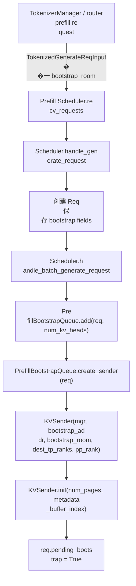
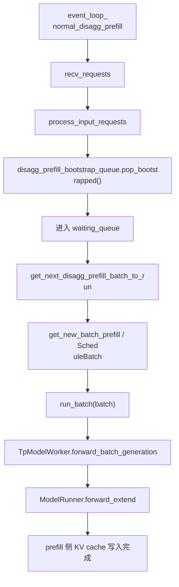
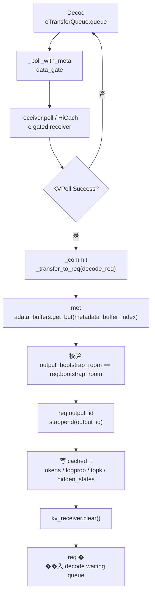

# 第 7 讲：Disaggregation / PD 分离

这
一讲接在第 6 讲之后。第 6 讲已经
解释了一个统一模型实例内部的多
进程、多卡、TP/PP/DP/EP rank 关系；�
��一讲开始看更高一层的部署拆分�
��

> Prefill 和 Decode 为什么可以拆�
�两类 server？请求在两个 server 之�
�如何交接？KV cache 又是怎么从 pref
ill 侧传到 decode 侧的？

本讲目标�
��

- 看懂 `disaggregation_mode = prefill /
 decode / null` 分别代表什么。
- 看�
� PD 分离中一个请求的生命周期。

- 看懂 prefill server 的 Bootstrap Queue�
�Waiting Queue、Inflight Queue。
- 看懂 d
ecode server 的 PreallocQueue、TransferQueu
e、WaitingQueue、RunningBatch。
- 看懂 b
ootstrap、prealloc、metadata、KV sender/re
ceiver、KV manager 的关系。
- 看懂 Moo
ncake / NIXL / Mori / Ascend / Fake 这些 tr
ansfer backend 如何接入统一抽象。
- 
看懂 PD 分离和 Scheduler、Req、Schedul
eBatch、KV cache pool、Radix cache 的关�
�。

---

## 0. 一张总图

```mermaid
flo
wchart TD
  U["用户请求"] --> DAPI["Decod
e server<br/>入口与 decode loop"]
  DAPI -
-> DReq["Decode Scheduler<br/>创建 Req"]
  
DReq --> Prealloc["PreallocQueue<br/>预分�
� decode 侧 KV slot"]
  Prealloc --> Receive
r["KVReceiver<br/>把 decode 侧 KV 地址发
给 prefill"]

  U -.bootstrap info.-> PAPI["
Prefill server"]
  PAPI --> PReq["Prefill Sch
eduler<br/>创建 Req"]
  PReq --> Bootstrap[
"PrefillBootstrapQueue<br/>创建 KVSender"]

  Bootstrap --> PForward["Prefill forward<br/
>写入 prefill 侧 KV cache"]
  PForward -->
 Sender["KVSender.send<br/>把 KV 传到 deco
de 侧"]
  Sender --> Receiver

  Receiver --
> Transfer["TransferQueue<br/>轮询 KV trans
fer 状态"]
  Transfer --> DWait["Decode Wai
tingQueue<br/>构造 prebuilt extend batch"]

  DWait --> Running["RunningBatch<br/>进入 
decode loop"]
  Running --> Out["输出 token
"]
```

一句话版：

> PD 分离把 promp
t prefill 和 token decode 拆到两个 serve
r。decode server 负责请求入口、KV 预
分配和后续 decode；prefill server 负�
�计算 prompt 的 KV cache，并通过 KV tr
ansfer backend 把 KV 写到 decode server �
�经预留好的位置。

---

## 1. 关键�
��件跳转表

| 主题 | 文件 | 具体定
位 |
|---|---|---|
| Scheduler 中的模式�
��始化 | `python/sglang/srt/managers/schedu
ler.py` | `Scheduler.__init__()` 中 `self.di
saggregation_mode = DisaggregationMode(...)`�
��prefill/decode 初始化分支 |
| 请求�
�口如何写入 bootstrap 信息 | `python/s
glang/srt/managers/scheduler.py` | `Scheduler
.handle_generate_request()`、`handle_batch_g
enerate_request()` |
| prefill 侧生命周�
� | `python/sglang/srt/disaggregation/prefill
.py` | 文件头生命周期注释、`Prefill
BootstrapQueue`、`SchedulerDisaggregationPre
fillMixin` |
| prefill 侧 bootstrap 队列 |
 `python/sglang/srt/disaggregation/prefill.py
` | `PrefillBootstrapQueue.__init__()`、`_in
it_kv_manager()`、`create_sender()`、`add()
` |
| prefill 侧 bootstrap 状态处理 | `p
ython/sglang/srt/disaggregation/prefill.py` |
 `SchedulerDisaggregationPrefillMixin.handle_
pending_bootstrap()`、`check_bootstrap()` |

| decode 侧生命周期 | `python/sglang/srt
/disaggregation/decode.py` | 文件头生命�
��期注释、`DecodeRequest`、`SchedulerDis
aggregationDecodeMixin` |
| decode 侧 req po
ol | `python/sglang/srt/disaggregation/decode
.py` | `DecodeReqToTokenPool`、`HybridMambaD
ecodeReqToTokenPool` |
| decode 侧 prealloc/
transfer 队列 | `python/sglang/srt/disaggre
gation/decode.py` | `PreallocQueue`、`Transf
erQueue` 相关 `add()` / poll 逻辑 |
| dec
ode 侧 batch mixin | `python/sglang/srt/disa
ggregation/decode_schedule_batch_mixin.py` | 
`ScheduleBatchDisaggregationDecodeMixin` |
| 
KV transfer 抽象 | `python/sglang/srt/disag
gregation/base/conn.py` | `KVArgs`、`KVPoll`
、`BaseKVManager`、`BaseKVSender`、`BaseKV
Receiver`、`BaseKVBootstrapServer` |
| 通�
� KV manager | `python/sglang/srt/disaggregat
ion/common/conn.py` | `CommonKVManager.__init
__()`、`register_to_bootstrap()`、`try_ensu
re_parallel_info()` |
| transfer backend 注�
�� | `python/sglang/srt/disaggregation/utils.
py` | `KVClassType`、`get_kv_class()` |
| Mo
oncake 后端 | `python/sglang/srt/disaggrega
tion/mooncake/conn.py` | `MooncakeKVManager`�
��`MooncakeKVSender`、`MooncakeKVReceiver`�
�`MooncakeKVBootstrapServer` |
| NIXL / Mori 
/ Ascend 后端 | `python/sglang/srt/disaggre
gation/nixl/conn.py`、`mori/conn.py`、`asce
nd/conn.py` | 各自的 `KVManager`、`KVSend
er`、`KVReceiver`、`KVBootstrapServer` |
| 
ServerArgs 配置 | `python/sglang/srt/server
_args.py` | `disaggregation_mode`、`disaggre
gation_bootstrap_port`、transfer backend 相
关字段 |

---

## 2. PD 分离解决什么
问题

LLM serving 里 prefill 和 decode �
�计算形态很不一样：

| 阶段 | 输�
��形态 | 计算特点 | 资源压力 |
|---
|---|---|---|
| Prefill | prompt 的多个 to
ken | 大 batch、大 token 数、attention �
��入整段 KV | 算力和显存带宽压力�
��，单次延迟峰值高 |
| Decode | 每�
�请求每轮 1 个或少量 token | 高频�
�步循环，强依赖 KV cache | 低延迟�
�连续调度、KV cache 常驻 |

统一部�
��时，一个 Scheduler 同时处理 prefill
 和 decode。PD 分离把两者拆开：

``
`mermaid
flowchart LR
  A["Prefill server<br/
>适合吞吐型 prompt 计算"] -->|"KV cach
e transfer"| B["Decode server<br/>适合低�
�迟 token loop"]
```

这样做的收益：


- prefill server 可以专门处理长 promp
t、chunked prefill、prefix 计算。
- deco
de server 可以专注持续 decode，减少�
�� prefill 对低延迟 token loop 的干扰�
��
- prefill 和 decode 可以独立扩缩容
。
- 在大模型或长上下文场景中，
可以把 KV cache transfer 作为部署层�
�显式数据流管理。

代价也很明确
：

- 必须引入 bootstrap 协议，让两
侧知道同一个请求对应哪个 transfer
 room。
- decode 侧必须先预留 KV cache
 位置，否则 prefill 侧不知道要把 K
V 写到哪里。
- 必须处理 transfer bac
kend 的失败、超时、abort、重试。
-
 Scheduler 的 waiting/running 状态不再�
�有普通队列，还多了 bootstrap、prea
lloc、transfer 等中间队列。

---

## 3
. 三种 `DisaggregationMode`

核心枚举�
� `python/sglang/srt/disaggregation/utils.py`
 的 `DisaggregationMode`。

| 模式 | 含�
�� | Scheduler 行为 |
|---|---|---|
| `NULL
` | 不启用 PD 分离 | 普通 SGLang 主�
�：请求在同一个 Scheduler 中 prefill 
+ decode。 |
| `PREFILL` | 当前实例是 p
refill server | 负责 prompt prefill，计�
� KV cache，并把 KV transfer 到 decode se
rver。 |
| `DECODE` | 当前实例是 decode
 server | 负责请求入口、预分配 deco
de KV slot、接收 prefill KV，然后进入
 decode loop。 |

Scheduler 初始化时会�
��据 `server_args.disaggregation_mode` 建�
�不同对象：

```mermaid
flowchart TD
  A
["Scheduler.__init__"] --> B["self.disaggrega
tion_mode"]
  B --> C{"mode"}
  C -->|"NULL"|
 N["普通 Scheduler<br/>无 PD 队列"]
  C 
-->|"PREFILL"| P["PrefillBootstrapQueue<br/>K
VManager(PREFILL)<br/>bootstrap server / send
er"]
  C -->|"DECODE"| D["Decode 侧队列<br
/>KVManager(DECODE)<br/>receiver / prealloc /
 transfer"]
```

在第 6 讲的多进程模�
��里，一个 Scheduler 子进程绑定一�
� GPU rank；在 PD 模式下，这个 Schedu
ler 还会额外带上 prefill 或 decode 的
职责。

---

## 4. 请求里的 bootstrap 
信息

PD 分离要让 prefill 和 decode �
�个 server 对同一个请求达成共识，
需要几个关键字段：

| 字段 | 所�
�对象 | 作用 |
|---|---|---|
| `bootstrap
_host` | `Req` / request input | prefill 或 
decode 对端的 host。 |
| `bootstrap_port`
 | `Req` / request input | bootstrap server �
��端口，默认来自 `server_args.disaggre
gation_bootstrap_port`。 |
| `bootstrap_room
` | `Req` / request input | 一次请求对�
�的 room id，用来匹配 sender 和 receiv
er。 |
| `pending_bootstrap` | `Req` | prefi
ll 侧表示 sender 还没有完成握手/预
分配。 |
| `disagg_kv_sender` | `Req` | pr
efill 侧持有的 KV sender。 |
| `metadata
_buffer_index` | `Req` / `DecodeRequest` | �
�于传输辅助 metadata 的 buffer slot。 
|
| `kv_committed_len` | `Req` | decode 侧�
�经确认可用的 KV 长度。 |

`Schedule
r.handle_generate_request()` 会补默认 `bo
otstrap_port`，并检查 PD 模式下请求�
��否携带足够 bootstrap 信息。`handle_
batch_generate_request()` 再根据模式把�
��求放入不同队列。

```mermaid
flowch
art TD
  A["TokenizedGenerateReqInput"] --> B
["Scheduler.handle_generate_request"]
  B -->
 C["创建 Req"]
  C --> D{"disaggregation_mo
de"}
  D -->|"NULL"| W["普通 waiting_queue"
]
  D -->|"PREFILL"| PB["disagg_prefill_boots
trap_queue.add(req)"]
  D -->|"DECODE"| DA["d
ecode prealloc / transfer 相关队列"]
```


---

## 5. KV transfer 抽象层

PD 分离�
��关键不是 HTTP，而是 KV cache 如何�
��一个 GPU/rank 写到另一个 GPU/rank。
SGLang 把这个能力抽象成几组类。


### 5.1 `KVArgs`

`KVArgs` 描述当前 rank 
的 KV cache 内存布局：

| 字段 | 含�
�� |
|---|---|
| `engine_rank` | 当前 prefi
ll/decode rank。 |
| `kv_data_ptrs` / `kv_da
ta_lens` / `kv_item_lens` | KV cache buffer �
��地址、长度、单 item 大小。 |
| `a
ux_data_ptrs` / `aux_data_lens` / `aux_item_l
ens` | 辅助 metadata buffer。 |
| `state_t
ypes` / `state_data_ptrs` | Mamba、SWA、DSA
 等额外状态缓存。 |
| `kv_head_num` /
 `total_kv_head_num` | 当前 rank 与全局 
KV head 数。 |
| `page_size` | paged KV cac
he 的 page 大小。 |
| `system_dp_rank` | 
系统级 DP rank。 |
| `pp_rank` / `prefill
_start_layer` / `prefill_end_layer` | PP 场�
��下当前 prefill stage 负责的层范围�
�� |

Prefill 侧的 `PrefillBootstrapQueue._
init_kv_manager()` 会从 `token_to_kv_pool.g
et_contiguous_buf_infos()` 取出这些 buffe
r 信息，然后创建 `KVManager`。

Decod
e 侧也会创建自己的 `KVManager`，但�
��的角色是 receiver：告诉 prefill 侧�
��请把 KV 写到我这里的这些地址/in
dices”。

### 5.2 `KVPoll`

`KVPoll` 是 t
ransfer 状态机：

| 状态 | 含义 |
|--
-|---|
| `Failed` | transfer 失败。 |
| `B
ootstrapping` | sender/receiver 正在握手�
�� |
| `WaitingForInput` | receiver 已准备
好，等待 prefill 侧真正产生 KV。 |

| `Transferring` | KV 正在传输。 |
| `Su
ccess` | KV 已传输完成，decode 可继�
�。 |

### 5.3 `BaseKVManager / BaseKVSender
 / BaseKVReceiver`

```mermaid
classDiagram
 
 class BaseKVManager {
    +register_to_boots
trap()
  }
  class BaseKVSender {
    +init(n
um_kv_indices, aux_index)
    +send(kv_indice
s, state_indices)
    +poll() KVPoll
    +fai
lure_exception()
  }
  class BaseKVReceiver {

    +init(prefill_dp_rank)
    +send_metadat
a(kv_indices, aux_index, state_indices, decod
e_prefix_len)
    +poll() KVPoll
    +failure
_exception()
  }
  class BaseKVBootstrapServe
r

  BaseKVManager <|-- CommonKVManager
  Bas
eKVSender <|-- CommonKVSender
  BaseKVReceive
r <|-- CommonKVReceiver
  BaseKVBootstrapServ
er <|-- MooncakeKVBootstrapServer
```

角色
分工：

| 对象 | 在 prefill 侧 | 在 d
ecode 侧 |
|---|---|---|
| `KVManager` | 管
理 prefill 侧 KV buffer，注册到 bootstr
ap server。 | 管理 decode 侧 KV buffer，
查询 prefill parallel info。 |
| `KVSender
` | 持有一个请求的 sender，负责把 
prefill KV 发出去。 | 不使用。 |
| `K
VReceiver` | 不使用。 | 持有一个请�
�的 receiver，负责把 decode 侧 KV indic
es/metadata 发给 prefill，并轮询 transf
er。 |
| `KVBootstrapServer` | 暴露 prefil
l server 的 parallel / KV 信息。 | decode
 侧通过 bootstrap 地址查询 prefill 信
息。 |

### 5.4 backend 注册

`python/sgl
ang/srt/disaggregation/utils.py:get_kv_class(
)` 根据 transfer backend 返回具体类：


| backend | Manager | Sender | Receiver | B
ootstrapServer |
|---|---|---|---|---|
| Moon
cake | `MooncakeKVManager` | `MooncakeKVSende
r` | `MooncakeKVReceiver` | `MooncakeKVBootst
rapServer` |
| NIXL | `NixlKVManager` | `Nixl
KVSender` | `NixlKVReceiver` | `NixlKVBootstr
apServer` |
| Mori | `MoriKVManager` | `MoriK
VSender` | `MoriKVReceiver` | `MoriKVBootstra
pServer` |
| Ascend | `AscendKVManager` | `As
cendKVSender` | `AscendKVReceiver` | `AscendK
VBootstrapServer` |
| Fake | `FakeKVManager` 
| `FakeKVSender` | `FakeKVReceiver` | Fake/te
sting backend |

第一遍读源码时不要�
��上来读 Mooncake/NIXL 的底层传输细�
��。先理解 `BaseKVSender.init/send/poll` 
与 `BaseKVReceiver.init/send_metadata/poll` 
这两个抽象，后端只是把这几个动
作落到不同通信库上。

---

## 6. Pr
efill server 生命周期

`python/sglang/srt
/disaggregation/prefill.py` 文件头已经�
�了最好的主线：

```text
1. Bootstrap 
Queue
2. Waiting Queue
3. Inflight Queue
```


展开后是：

```mermaid
flowchart TD
  A
["请求进入 prefill Scheduler"] --> B["Pre
fillBootstrapQueue.add(req)"]
  B --> C["crea
te_sender(req)"]
  C --> D["KVSender.init<br/
>握手 / 通知 KV 长度"]
  D --> E["queue
 中等待 bootstrap 完成"]
  E --> F{"chec
k_bootstrap(req)"}
  F -->|"未完成"| E
  F
 -->|"完成"| G["进入 waiting_queue"]
  G 
--> H["Scheduler 组 prefill batch"]
  H --> 
I["ModelRunner.forward_extend<br/>写入 pref
ill KV cache"]
  I --> J["KVSender.send(kv_in
dices, state_indices)"]
  J --> K["Inflight Q
ueue 轮询 sender.poll"]
  K --> L{"transfer
 success?"}
  L -->|"否"| K
  L -->|"是"| M
["请求在 prefill 侧完成"]
```

### 6.1 
Bootstrap Queue

`PrefillBootstrapQueue` 的�
��责是“在真正 prefill forward 之前�
�把 transfer 的控制面准备好”。

�
�键函数：

| 函数 | 做什么 |
|---|--
-|
| `__init__()` | 保存 KV pool、metadata
 buffer、rank、bootstrap port、scheduler�
�并创建 `kv_manager`。 |
| `_init_kv_mana
ger()` | 从 `token_to_kv_pool`、draft KV po
ol、metadata buffer 中收集指针和长度
，构造 `KVArgs`，再通过 `get_kv_class(
)` 创建 backend manager。 |
| `create_send
er(req, num_kv_heads)` | 为单个请求创�
� `KVSender`，绑定 `bootstrap_addr`、`boo
tstrap_room`、目标 TP rank 等信息。 |

| `ensure_metadata_buffer(req)` | 为请求�
�配辅助 metadata buffer slot。 |
| `add(r
eq, num_kv_heads)` | 把请求加入 bootstra
p queue，等待 sender/receiver 握手和 de
code 侧预分配完成。 |

`create_sender(
)` 里最关键的是这段关系：

```text

req.disagg_kv_sender = kv_sender_class(
    
mgr=self.kv_manager,
    bootstrap_addr=f"{re
q.bootstrap_host}:{self.bootstrap_port}",
   
 bootstrap_room=req.bootstrap_room,
    dest_
tp_ranks=[self.tp_rank],
    pp_rank=self.pp_
rank,
)
```

它说明 sender 是“按请求
”创建的，而 manager 是“按 rank / s
cheduler”创建的。

### 6.2 Waiting Queu
e

当 `check_bootstrap(req)` 返回完成后
，请求进入普通 waiting queue。此时�
��和普通 prefill 请求很像：Scheduler 
会把它放进 `ScheduleBatch`，执行 exte
nd/prefill forward。

不同点在于：

- 
这个请求已经有 `disagg_kv_sender`。
-
 它可能有 `metadata_buffer_index`。
- pr
efill 完成后不能直接进入本地 decod
e，而是要发 KV 给 decode 侧。

### 6.
3 Inflight Queue

prefill forward 写完 KV c
ache 后，prefill 侧会调用 sender 的 `s
end()`，把指定 `kv_indices` 对应的 KV 
传输给 decode。

Inflight Queue 负责轮
询 transfer：

```mermaid
flowchart LR
  A[
"prefill forward done"] --> B["KVSender.send"
]
  B --> C["Inflight Queue"]
  C --> D["send
er.poll"]
  D --> E{"KVPoll"}
  E -->|"Transf
erring"| C
  E -->|"Success"| F["释放/完�
� prefill 请求"]
  E -->|"Failed"| G["失�
�处理 / abort"]
```

---

## 7. Decode serv
er 生命周期

`python/sglang/srt/disaggreg
ation/decode.py` 文件头把 decode 侧分�
�四段：

```text
1. PreallocQueue
2. Trans
ferQueue
3. WaitingQueue
4. RunningBatch
```


展开后是：

```mermaid
flowchart TD
  A
["请求进入 decode Scheduler"] --> B["创�
�� DecodeRequest"]
  B --> C["创建 KVReceiv
er"]
  C --> D["PreallocQueue"]
  D --> E{"de
code 侧 KV slot 足够?"}
  E -->|"否"| D
 
 E -->|"是"| F["分配 req_pool_idx / KV ind
ices / metadata buffer"]
  F --> G["KVReceive
r.send_metadata<br/>把 decode KV 地址发�
� prefill"]
  G --> H["TransferQueue"]
  H --
> I["receiver.poll"]
  I --> J{"KVPoll"}
  J 
-->|"WaitingForInput / Transferring"| H
  J -
->|"Success"| K["WaitingQueue"]
  K --> L["�
�造 PrebuiltExtendBatch<br/>跳过本地 pre
fill forward"]
  L --> M["合入 RunningBatch
"]
  M --> N["decode loop"]
```

### 7.1 `Dec
odeReqToTokenPool`

普通 `ReqToTokenPool` �
��容量约束是：

```text
#pre-allocated 
+ #transfer + #running <= max_running_request
s
```

decode 侧为了让 prefill 尽早开�
��，需要提前预分配一些还没进入 
running batch 的请求。因此 `DecodeReqTo
TokenPool` 扩展了容量：

```text
#runni
ng <= max_running_requests
#pre-allocated + #
transfer <= pre_alloc_size
```

这也是 dec
ode 侧和普通 Scheduler 最大的内存池
差异之一：decode server 需要容纳“�
��在等 KV transfer 的请求”。

### 7.2
 PreallocQueue

PreallocQueue 的职责：

1
. 创建或持有 `KVReceiver`。
2. 等待 d
ecode 侧 KV cache 有足够空间。
3. 分�
�� `req_pool_idx` 与 KV indices。
4. 调用
 `receiver.send_metadata(...)`，把 decode �
��地址告诉 prefill。
5. 把请求移动�
�� TransferQueue。

### 7.3 TransferQueue

T
ransferQueue 负责轮询 receiver：

```mer
maid
flowchart LR
  A["KVReceiver.send_metada
ta"] --> B["TransferQueue"]
  B --> C["receiv
er.poll"]
  C --> D{"状态"}
  D -->|"Bootst
rapping"| B
  D -->|"WaitingForInput"| B
  D 
-->|"Transferring"| B
  D -->|"Success"| E["�
��入 decode waiting queue"]
  D -->|"Failed"
| F["失败 / abort / cleanup"]
```

这里�
�重要的概念是：decode 侧并不计算 
prompt prefill，但它要先知道 prompt �
� KV cache 已经被写入自己的 KV pool�
�只有 `KVPoll.Success` 后，请求才能�
�入后续 decode。

### 7.4 WaitingQueue �
� RunningBatch

当 transfer 成功后，deco
de 侧会构造一个“prebuilt extend batch
”。它不是为了重新跑 prefill，而�
��为了把请求的 metadata、seq len、KV 
indices、prefix 状态等放到 Scheduler �
�理解的 batch 结构里。

然后请求�
�入 `running_batch`，之后就和普通 dec
ode 请求一样，每轮生成新 token。


---

## 8. Prefill 与 Decode 的镜像关系


| 维度 | Prefill server | Decode server |

|---|---|---|
| 请求入口 | 接收带 boo
tstrap 信息的 prefill 请求 | 通常作�
�用户入口，创建 decode 请求 |
| 核�
��队列 | Bootstrap Queue、Waiting Queue、
Inflight Queue | PreallocQueue、TransferQueu
e、WaitingQueue、RunningBatch |
| KV 对象
 | `KVSender` | `KVReceiver` |
| KVManager �
�色 | 暴露 prefill KV buffer，注册 boot
strap server | 查询 prefill parallel info�
�管理 decode KV buffer |
| 计算动作 | �
��的执行 prompt prefill forward | 不重�
�算 prompt prefill，只接收 KV |
| 完成
条件 | prefill forward + KV transfer succes
s | KV transfer success 后进入 decode loop
 |
| 失败处理 | sender failure / bootstra
p timeout / abort | receiver failure / preall
oc 不足 / transfer timeout / abort |

可�
�把它想成一次“搬家”：

- Decode 
侧先准备好房间和门牌号：KV slot�
�metadata buffer、bootstrap room。
- Prefil
l 侧负责生产家具：prompt KV cache。

- Transfer backend 负责把家具搬到 deco
de 侧指定房间。
- Decode 侧确认家�
�到位后，开始正常生活：进入 deco
de loop。

---

## 9. 和 Scheduler 主循�
�的关系

PD 分离并没有换掉 Schedule
r，而是让 Scheduler 在不同模式下多
维护几类队列。

```mermaid
flowchart T
D
  S["Scheduler event loop"] --> R["recv_req
uests"]
  R --> H["handle_generate_request / 
handle_batch_generate_request"]
  H --> M{"di
saggregation_mode"}
  M -->|"NULL"| W["waitin
g_queue"]
  M -->|"PREFILL"| PB["disagg_prefi
ll_bootstrap_queue"]
  M -->|"DECODE"| DP["de
code prealloc / transfer queues"]

  PB --> P
W["bootstrap done -> waiting_queue"]
  DP -->
 DW["transfer done -> waiting_queue / prebuil
t batch"]

  W --> B["get_next_batch_to_run"]

  PW --> B
  DW --> B
  B --> F["TpModelWork
er / ModelRunner"]
```

### 9.1 `is_idle()` �
��什么要看更多队列

普通模式下�
�Scheduler 是否 idle 主要看 waiting/runn
ing queue。PD 模式下还要看：

- prefi
ll 的 bootstrap queue
- prefill 的 inflight
 transfer
- decode 的 prealloc queue
- decod
e 的 transfer queue

否则会出现“Sched
uler 以为自己空闲，但其实还有请�
��在等待 KV transfer”的错误判断。


### 9.2 abort 为什么更复杂

普通请�
�� abort 只需要从 waiting/running 中移�
��并释放 KV。PD 请求可能处在：

- 
prefill bootstrap queue
- prefill waiting que
ue
- prefill inflight transfer
- decode preal
loc queue
- decode transfer queue
- decode ru
nning batch

不同阶段需要清理的对�
�不同：metadata buffer、req pool slot、K
V slot、sender/receiver 状态、bootstrap r
oom 状态都可能要处理。

---

## 10. 
和 KV Cache / Radix Cache 的关系

PD 分�
��不是替代 KV cache，而是改变 KV cac
he 的生产位置和消费位置。

```merm
aid
flowchart LR
  P["Prefill KV pool"] -->|"
transfer kv_indices 对应内容"| D["Decode 
KV pool"]
  D --> R["Decode running batch"]
 
 R --> A["Attention backend 读取 decode KV 
pool"]
```

### 10.1 prefill 侧

prefill 侧
会正常执行 prompt forward，因此它会
：

- 分配 prefill 侧 KV cache slot。
- 
写入 prompt 的 KV。
- 根据 `kv_indices`
 把这些 KV 发送出去。
- transfer 完�
��后释放或回收 prefill 侧请求资源�
��

### 10.2 decode 侧

decode 侧需要提�
��分配目标 KV slot，因为 transfer 要�
��入这些 slot：

- `DecodeReqToTokenPool`
 记录请求到 token slot 的映射。
- KV
 allocator 分配 decode 侧目标 KV indices
。
- `KVReceiver.send_metadata()` 把这些 
indices 通知 prefill。
- transfer 完成�
�，decode attention backend 就能像普通�
��求一样读取这些 KV。

### 10.3 Radix
 cache / HiCache

PD 模式也会遇到 prefi
x cache：

- decode 侧可能先做 prefix m
atch，判断哪些 KV 已经可以复用。

- prefill 侧可能只需要计算未命中�
�部分。
- HiCache 模式下，decode 侧�
�有 restore/load-back 相关状态，`decode
_hicache_mixin.py` 会参与 prealloc/transfe
r 流程。

第一遍读 PD 时，可以先�
��“没有 prefix cache 命中”的路径�
�解。第二遍再叠加 Radix/HiCache。

-
--

## 11. 和 TP / PP / DP 的关系

PD 分
离本身不是 TP/PP/DP 的替代品。prefi
ll server 和 decode server 内部仍然可�
�各自使用 TP、PP、DP、EP。

```mermai
d
flowchart TB
  subgraph Prefill["Prefill se
rver"]
    P0["TP/PP/EP ranks"]
    PS["Prefi
ll Scheduler"]
    PK["Prefill KV pool"]
  en
d

  subgraph Decode["Decode server"]
    D0[
"TP/PP/EP ranks"]
    DS["Decode Scheduler"]

    DK["Decode KV pool"]
  end

  PK -->|"KV 
transfer backend"| DK
```

几个关键点：


| 并行 | 在 PD 中的影响 |
|---|---|

| TP | prefill 和 decode 侧可能都有 TP 
rank。transfer backend 需要知道目标 TP
 rank 和 KV head 分片。 |
| PP | prefill 
侧每个 PP stage 可能只负责部分 laye
r，因此 `KVArgs` 里有 `pp_rank`、`prefi
ll_start_layer`、`prefill_end_layer`。 |
| 
DP | 多个 prefill/decode 副本时，bootst
rap room 和 routing 必须确保同一请求
的两端匹配。 |
| DP attention / CP | tr
ansfer 时要考虑 attention TP/CP 的 KV �
�分方式，metadata 里要保留足够信�
�。 |
| EP / MoE | MoE 不直接改变 KV ca
che 的语义，但会影响模型 rank 和 f
orward 执行过程。 |

`KVArgs` 中的 `kv
_head_num`、`total_kv_head_num`、`pp_rank`�
��`prefill_start_layer`、`prefill_end_layer`
 就是在为这些并行组合提供信息�
�

---

## 12. 一次 PD 请求的完整时�
�

```mermaid
sequenceDiagram
  participant U
ser as Client
  participant Decode as Decode 
Scheduler
  participant Receiver as KVReceive
r
  participant Prefill as Prefill Scheduler

  participant Sender as KVSender
  participan
t PModel as Prefill ModelRunner
  participant
 DModel as Decode ModelRunner

  User->>Decod
e: GenerateReqInput
  Decode->>Decode: 创建
 Req / bootstrap_room
  Decode->>Receiver: in
it(prefill_dp_rank)
  Decode->>Decode: preall
oc req_pool_idx / kv_indices / metadata buffe
r
  Decode->>Receiver: send_metadata(kv_indic
es, aux_index, state_indices)

  User->>Prefi
ll: Prefill 请求或路由后的请求
  Pre
fill->>Sender: create_sender(req)
  Sender->>
Receiver: bootstrap handshake
  Prefill->>Pre
fill: bootstrap done -> waiting_queue
  Prefi
ll->>PModel: prefill forward
  PModel-->>Pref
ill: KV cache written
  Prefill->>Sender: sen
d(kv_indices, state_indices)
  Sender-->>Rece
iver: KV transfer
  Receiver-->>Decode: poll(
) = Success
  Decode->>Decode: transfer queue
 -> waiting queue
  Decode->>DModel: decode f
orward
  DModel-->>Decode: next token
  Decod
e-->>User: stream output
```

---

## 12.1 �
�细的模块通信视角

上一张时序图
是逻辑视角；真正读源码时，需要
再把它拆成几类通信：

| 通信类�
� | 谁和谁通信 | 传递内容 | 代码�
�口 |
|---|---|---|---|
| 请求入口 IPC |
 `TokenizerManager -> Decode Scheduler` 或 `
TokenizerManager -> Prefill Scheduler` | `Tok
enizedGenerateReqInput` / `BatchTokenizedGene
rateReqInput`，包含 token ids、sampling p
arams、bootstrap fields | `SchedulerRequestR
eceiver.recv_requests()`、`Scheduler.handle_
generate_request()` |
| Scheduler 内部队�
�移动 | Scheduler event loop 内部 | `Req`
、`DecodeRequest`、`ScheduleBatch` | `handl
e_batch_generate_request()`、`PrefillBootstr
apQueue.add()`、`DecodePreallocQueue.add()` 
|
| bootstrap 信息查询 | decode 侧 `KVMa
nager -> prefill bootstrap server` | prefill 
parallel info、dp rank、tp/pp 拓扑、boot
strap room routing | `CommonKVManager.try_ens
ure_parallel_info()`、后端 `KVBootstrapSer
ver` |
| decode 到 prefill 的 metadata 通�
�� | `KVReceiver -> KVSender / prefill manage
r` | decode 侧 `kv_indices`、`aux_index`、
`state_indices`、`decode_prefix_len` | `Base
KVReceiver.send_metadata()`、`DecodePrealloc
Queue` 中调用 `kv_receiver.send_metadata(.
..)` |
| prefill 到 decode 的 KV 数据传�
�� | `KVSender -> KVReceiver / decode KV buff
er` | page-aligned KV cache blocks、Mamba/SW
A/DSA state、aux metadata | `BaseKVSender.se
nd()`、`SchedulerDisaggregationPrefillMixin.
send_kv_chunk()` |
| transfer 状态轮询 | 
prefill / decode 各自队列轮询 sender/re
ceiver | `KVPoll.Bootstrapping / WaitingForIn
put / Transferring / Success / Failed` | `pol
l_and_all_reduce*()`、`DecodeTransferQueue`�
��`process_disagg_prefill_inflight_queue()` |

| 输出回流 IPC | `Decode Scheduler -> De
tokenizerManager -> TokenizerManager` | `Batc
hTokenIDOutput`、`BatchStrOutput`、finish r
eason、logprob | `SchedulerOutputStreamer`�
�`DetokenizerManager.handle_batch_token_id_ou
t()` |

注意这里有两条路径：

- **�
��制路径**：请求对象、bootstrap room
、metadata、状态轮询。
- **数据路�
�**：真正的 KV cache block / state buffer
 传输。

PD 分离难读，就是因为这
两条路径交织在一起：decode 侧先�
�控制路径告诉 prefill “我的 KV 位�
��在哪里”，prefill 侧完成计算后�
�走数据路径把 KV 写过去。

---

## 
12.2 端到端调用流程：从 decode 入�
�到首个 decode token

下面按“谁调�
�谁”展开一次最典型的请求。为�
�便于第一遍阅读，这里先假设：


- 请求从 decode server 入口进入。
- p
refill server 也会收到对应请求或由�
��层路由到对应 prefill 实例。
- 无 
HiCache restore。
- 无 PP。
- 无 optimist
ic prefill retry。
- transfer backend 只看
抽象，不展开 Mooncake/NIXL 线程细节
。

### 阶段 A：Decode server 接收请�
�并进入 prealloc

```mermaid
flowchart TD

  A["TokenizerManager<br/>decode server 主�
�程"] -->|"TokenizedGenerateReqInput<br/>inp
ut_ids / sampling_params / bootstrap_host / b
ootstrap_room"| B["Decode Scheduler<br/>Sched
ulerRequestReceiver.recv_requests"]
  B --> C
["Scheduler.handle_generate_request"]
  C -->
 D["创建 Req<br/>保存 bootstrap_host / po
rt / room"]
  D --> E["Scheduler.handle_batch
_generate_request"]
  E --> F["DecodePrealloc
Queue.add(req)"]
  F --> G["DecodePreallocQue
ue._create_receiver_and_enqueue"]
  G --> H["
KVReceiver(mgr, bootstrap_addr, bootstrap_roo
m)"]
  H --> I["DecodeRequest(req, kv_receive
r)"]
```

这一阶段传递的主要内容�
�

| 对象 | 关键字段 | 用途 |
|---|--
-|---|
| `TokenizedGenerateReqInput` | `input
_ids`、`sampling_params`、`bootstrap_host`�
��`bootstrap_port`、`bootstrap_room` | 从 t
okenizer 侧进入 decode Scheduler 的请求
对象。 |
| `Req` | `origin_input_ids`、`s
ampling_params`、`bootstrap_*` | Scheduler �
��部的请求状态。 |
| `DecodeRequest` |
 `req`、`kv_receiver`、`metadata_buffer_ind
ex` | decode PD 队列内部对象，把普�
� `Req` 和 transfer receiver 绑在一起。
 |
| `KVReceiver` | `bootstrap_addr`、`boots
trap_room` | 后续负责通知 prefill 侧�
�标 KV 地址，并轮询 transfer。 |

对
应源码定位：

- `python/sglang/srt/mana
gers/scheduler_components/request_receiver.py
` / `SchedulerRequestReceiver.recv_requests()
`
- `python/sglang/srt/managers/scheduler.py`
 / `Scheduler.handle_generate_request()`
- `p
ython/sglang/srt/managers/scheduler.py` / `Sc
heduler.handle_batch_generate_request()`
- `p
ython/sglang/srt/disaggregation/decode.py` / 
`DecodePreallocQueue.add()`
- `python/sglang/
srt/disaggregation/decode.py` / `DecodePreall
ocQueue._create_receiver_and_enqueue()`

### 
阶段 B：Decode server 查询 prefill 信�
�并预分配目标 KV

```mermaid
flowchart 
TD
  A["DecodePreallocQueue.queue"] --> B{"�
�否已缓存 prefill_info?"}
  B -->|"否"| 
C["kv_manager.try_ensure_parallel_info(bootst
rap_addr)"]
  C --> D["HTTP/bootstrap 查询 
prefill server<br/>parallel info / dp size / 
routing"]
  D --> E["确定 prefill_dp_rank"]

  B -->|"是"| E
  E --> F["KVReceiver.init(
prefill_dp_rank)"]
  F --> G{"decode 侧资�
�是否足够?"}
  G -->|"否"| A
  G -->|"�
�"| H["分配 req_pool_idx"]
  H --> I["分�
� token_to_kv_pool_allocator 的 KV indices"]

  I --> J["分配 metadata_buffer_index / au
x_index"]
  J --> K["KVReceiver.send_metadata
(kv_indices, aux_index, state_indices, decode
_prefix_len)"]
  K --> L["DecodeTransferQueue
.add(decode_req)"]
```

这一阶段最关键
的动作不是传 KV，而是告诉 prefill�
��

```text
请把 bootstrap_room = X 的请�
��，对应的 prompt KV，
写到 decode 侧
这些 kv_indices / aux_index / state_indices
 上。
```

传递内容拆开看：

| 内�
�� | 从哪来 | 发给谁 | 作用 |
|---|--
-|---|---|
| `prefill_dp_rank` | `CommonKVMan
ager.try_ensure_parallel_info()` 或 room rou
ting | `KVReceiver.init()` | 确定请求应�
��找哪个 prefill DP rank。 |
| `kv_indice
s` | decode 侧 KV allocator | prefill sender
 | prefill 侧 transfer 的目标位置。 |

| `aux_index` / `metadata_buffer_index` | `Re
qToMetadataIdxAllocator` | prefill sender | �
��于写 output token、cached tokens、logpr
ob、bootstrap room 校验等 metadata。 |
|
 `state_indices` | Mamba/SWA/DSA 等状态池
 | prefill sender | 除普通 KV 之外的模
型状态传输目标。 |
| `decode_prefix_l
en` | decode prefix match / cache 状态 | pr
efill sender | 告诉 prefill 哪部分 prefi
x 已在 decode 侧可复用。 |

源码定�
��：

- `python/sglang/srt/disaggregation/de
code.py` / `DecodePreallocQueue._resolve_pref
ill_dp_rank()`
- `python/sglang/srt/disaggreg
ation/common/conn.py` / `CommonKVManager.try_
ensure_parallel_info()`
- `python/sglang/srt/
disaggregation/decode.py` / `DecodePreallocQu
eue` 中调用 `kv_receiver.init(...)`
- `pyt
hon/sglang/srt/disaggregation/decode.py` / `D
ecodePreallocQueue` 中调用 `kv_receiver.se
nd_metadata(...)`
- `python/sglang/srt/disagg
regation/decode.py` / `DecodeTransferQueue.ad
d()`

### 阶段 C：Prefill server 接收请
求并创建 sender



prefill 侧和 decode 侧�
��持有同一个 `bootstrap_room`。它们�
�是通过 Python 对象共享状态，而是
通过 bootstrap server / transfer backend �
� room 映射到对应 sender/receiver 状态
。

`PrefillBootstrapQueue.create_sender()` 
传给 sender 的信息：

| 参数 | 含义
 |
|---|---|
| `mgr=self.kv_manager` | 当前
 prefill rank 的 KV manager，知道本 rank
 KV buffer 指针。 |
| `bootstrap_addr=f"{r
eq.bootstrap_host}:{self.bootstrap_port}"` | 
decode 或 bootstrap 对端地址。 |
| `boo
tstrap_room=req.bootstrap_room` | 请求级 t
ransfer room。 |
| `dest_tp_ranks=[self.tp_r
ank]` | 目标 TP rank。 |
| `pp_rank=self.p
p_rank` | PP 场景下当前 prefill stage。
 |

源码定位：

- `python/sglang/srt/dis
aggregation/prefill.py` / `PrefillBootstrapQu
eue.add()`
- `python/sglang/srt/disaggregatio
n/prefill.py` / `PrefillBootstrapQueue.create
_sender()`
- `python/sglang/srt/disaggregatio
n/prefill.py` / `PrefillBootstrapQueue._proce
ss_req()`

### 阶段 D：Prefill event loop 
等 bootstrap 完成，然后跑 prefill forw
ard



这一阶段是普通 prefill forward �
� PD 控制面的交汇点：

- `pop_bootstr
apped()` 只把 sender/receiver 握手完成�
��请求放进 waiting queue。
- `get_next_d
isagg_prefill_batch_to_run()` 仍然复用 Sc
heduler 的 prefill batch 构造。
- `run_ba
tch()` 仍然进入 `TpModelWorker -> ModelRu
nner`。
- 模型 forward 写入的是 prefil
l server 本地 KV cache。

源码定位：


- `python/sglang/srt/disaggregation/prefill.
py` / `SchedulerDisaggregationPrefillMixin.ev
ent_loop_normal_disagg_prefill()`
- `python/s
glang/srt/disaggregation/prefill.py` / `Sched
ulerDisaggregationPrefillMixin.get_next_disag
g_prefill_batch_to_run()`
- `python/sglang/sr
t/managers/tp_worker.py` / `TpModelWorker.for
ward_batch_generation()`
- `python/sglang/srt
/model_executor/model_runner.py` / `ModelRunn
er.forward_extend()`

### 阶段 E：Prefill 
forward 结束后发送 KV 和 metadata

```m
ermaid
flowchart TD
  A["process_batch_result
_disagg_prefill(batch, result)"] --> B["遍�
� batch.reqs"]
  B --> C["req.output_ids.appe
nd(next_token_id)"]
  C --> D["maybe_cache_un
finished_req(req, tree_cache)"]
  D --> E["�
� logprob / topk / hidden states 到 req 或 
metadata"]
  E --> F["send_kv_chunk(req, last
_chunk=True)"]
  F --> G["kv_to_page_indices(
req KV indices)"]
  G --> H["req.disagg_kv_se
nder.send(page_indices, state_indices)"]
  H 
--> I["req 进入 disagg_prefill_inflight_que
ue"]
```

这一阶段传递的内容分两�
�：

| 类型 | 内容 | 目的 |
|---|---|-
--|
| KV 数据 | `page_indices` 对应的 K/
V cache block | 让 decode 侧得到 prompt K
V。 |
| 辅助 metadata | `next_token_id`、
`cached_tokens`、logprob、top-k、hidden st
ates、`bootstrap_room` | 让 decode 侧恢�
�请求状态，并校验 metadata 没串 roo
m。 |

`send_kv_chunk()` 会处理 page 对�
��、state indices、是否应该发送当前
 chunk 等细节。对于 chunked prefill，�
��可能不是只调用一次；对于普通 
prefill，通常最后一个 chunk 会 `last_
chunk=True`。

源码定位：

- `python/sg
lang/srt/disaggregation/prefill.py` / `Schedu
lerDisaggregationPrefillMixin.process_batch_r
esult_disagg_prefill()`
- `python/sglang/srt/
disaggregation/prefill.py` / `SchedulerDisagg
regationPrefillMixin.send_kv_chunk()`
- `pyth
on/sglang/srt/disaggregation/base/conn.py` / 
`BaseKVSender.send()`

### 阶段 F：Prefill
 侧 inflight 队列轮询 transfer 完成

`
``mermaid
flowchart TD
  A["disagg_prefill_in
flight_queue"] --> B["process_disagg_prefill_
inflight_queue"]
  B --> C["poll_and_all_redu
ce_attn_cp_tp_group(sender list)"]
  C --> D{
"KVPoll"}
  D -->|"Transferring / WaitingForI
nput"| A
  D -->|"Success"| E["释放 prefill
 侧资源 / stream prefill 完成状态"]
  
D -->|"Failed"| F["sender.failure_exception /
 abort / cleanup"]
```

为什么要 `all_red
uce`？

在 TP、attention TP、CP 等多 ra
nk 场景下，一个请求的 transfer 状�
�必须在相关 rank 上一致。否则某�
� rank 以为请求完成，另一些 rank �
�在等待，就会造成队列分歧或 coll
ective 卡住。

源码定位：

- `python/
sglang/srt/disaggregation/prefill.py` / `Sche
dulerDisaggregationPrefillMixin.process_disag
g_prefill_inflight_queue()`
- `python/sglang/
srt/disaggregation/utils.py` / `poll_and_all_
reduce_attn_cp_tp_group()`

### 阶段 G：De
code 侧 transfer queue 确认成功并 commi
t 到 Req



`_commit_tr
ansfer_to_req()` 是 decode 侧很关键的�
�数。它不是只看 KV 是否到了，还�
��把 prefill 侧生成的请求状态合并�
�� decode 侧 `Req`。

commit 的主要内�
�：

| 内容 | 从哪里来 | 写到哪里 
|
|---|---|---|
| `output_id` | metadata buff
er | `decode_req.req.output_ids` |
| `cached_
tokens` | metadata buffer | `req.cached_token
s`、`req.already_computed` |
| `output_token
_logprobs_*` | metadata buffer | `req.logprob
` |
| `output_topk_*` | metadata buffer | spe
culative decoding 相关字段 |
| `output_hi
dden_states` | metadata buffer | `req.hidden_
states_tensor` |
| `output_bootstrap_room` | 
metadata buffer | 用于校验是否发生 me
tadata buffer 串写 |

源码定位：

- `p
ython/sglang/srt/disaggregation/decode.py` / 
`DecodeTransferQueue._poll_with_metadata_gate
()`
- `python/sglang/srt/disaggregation/decod
e.py` / `DecodeTransferQueue._commit_transfer
_to_req()`

### 阶段 H：Decode 侧构造 p
rebuilt batch，进入正常 decode loop

```
mermaid
flowchart TD
  A["transfer success �
� Req"] --> B["decode waiting queue"]
  B -->
 C["构造 PrebuiltExtendBatch / prepare_for_
prebuilt"]
  C --> D["合并到 running_batch
"]
  D --> E["ScheduleBatch.prepare_for_decod
e"]
  E --> F["TpModelWorker.forward_batch_ge
neration"]
  F --> G["ModelRunner.forward_dec
ode"]
  G --> H["Sampler.sample"]
  H --> I["
SchedulerOutputStreamer -> DetokenizerManager
"]
```

这里“prebuilt extend”容易误�
��：decode 侧不是重新跑 prompt prefill
，而是把已经 transfer 完成的 KV 和�
��求 metadata 接回 Scheduler 的 batch 结
构中。之后请求就像普通 running req
uest 一样，每轮 decode 一个 token。


源码定位：

- `python/sglang/srt/disaggr
egation/decode.py` / `SchedulerDisaggregation
DecodeMixin`
- `python/sglang/srt/disaggregat
ion/decode_schedule_batch_mixin.py` / `Schedu
leBatchDisaggregationDecodeMixin`
- `python/s
glang/srt/managers/schedule_batch.py` / `Sche
duleBatch.prepare_for_decode()`
- `python/sgl
ang/srt/model_executor/model_runner.py` / `Mo
delRunner.forward_decode()`

---

## 12.3 两
个 server 的 event loop 对照

### Prefill
 server event loop

```mermaid
flowchart TD
 
 A["event_loop_normal_disagg_prefill"] --> B[
"recv_requests"]
  B --> C["process_input_req
uests"]
  C --> D["pop_bootstrapped -> waitin
g_queue"]
  D --> E["get_next_disagg_prefill_
batch_to_run"]
  E --> F{"batch?"}
  F -->|"�
��"| G["run_batch"]
  G --> H["process_batch_
result_disagg_prefill"]
  H --> I["send_kv_ch
unk / inflight_queue"]
  F -->|"无"| J["on_i
dle"]
  I --> K["process_disagg_prefill_infli
ght_queue"]
  J --> K
  K --> A
```

### Deco
de server event loop

```mermaid
flowchart TD

  A["event_loop_normal_disagg_decode"] --> B
["recv_requests"]
  B --> C["process_input_re
quests"]
  C --> D["DecodePreallocQueue<br/>r
esolve prefill info + alloc KV + send_metadat
a"]
  D --> E["DecodeTransferQueue<br/>poll r
eceiver + commit metadata"]
  E --> F["resolv
ed reqs -> waiting/prebuilt"]
  F --> G["get_
next_batch_to_run"]
  G --> H{"batch?"}
  H -
->|"有"| I["run_batch<br/>decode forward"]
 
 I --> J["process_batch_result<br/>stream tok
en"]
  H -->|"无"| K["on_idle"]
  J --> A
  
K --> A
```

两个 loop 的本质差异：


| 对照项 | Prefill server | Decode server 
|
|---|---|---|
| 请求进入后的第一站
 | `PrefillBootstrapQueue` | `DecodePreallocQ
ueue` |
| 什么时候能跑模型 | bootstra
p 完成后 | transfer 成功并 commit 后 |

| 模型 forward 模式 | prefill / extend |
 decode |
| forward 后做什么 | 发送 KV�
��进入 inflight queue | 采样 next token�
�输出给用户 |
| 队列中轮询谁 | `KV
Sender.poll()` | `KVReceiver.poll()` |

---


## 12.4 传递内容总表

| 阶段 | 发送
方 | 接收方 | 载体 / 对象 | 关键字
段 / 内容 | 目的 |
|---|---|---|---|---|
---|
| 请求进入 decode | `TokenizerManage
r` | `Decode Scheduler` | `TokenizedGenerateR
eqInput` | token ids、sampling params、rid�
��bootstrap fields | 创建 decode 侧 `Req`�
�� |
| 请求进入 prefill | `TokenizerManag
er` / router | `Prefill Scheduler` | `Tokeniz
edGenerateReqInput` | 同一 prompt、同一 
`bootstrap_room` | 创建 prefill 侧 `Req`�
� |
| prefill 信息查询 | `Decode KVManage
r` | `Prefill bootstrap server` | HTTP / back
end control request | prefill dp size、paral
lel info、routing info | 确定 receiver 应
该连哪个 prefill rank。 |
| receiver 初
始化 | `DecodePreallocQueue` | `KVReceiver`
 | 方法调用 | `prefill_dp_rank` | 让 rec
eiver 绑定正确 prefill 对端。 |
| deco
de 侧 metadata 通知 | `KVReceiver` | `KVSe
nder` / prefill backend | backend metadata �
�息 | `kv_indices`、`aux_index`、`state_in
dices`、`decode_prefix_len` | 告诉 prefill
 KV 要写到哪里。 |
| prefill forward | 
`Prefill Scheduler` | `ModelRunner` | `Schedu
leBatch -> ForwardBatch` | input ids、positi
ons、cache loc | 计算 prompt KV。 |
| KV 
数据传输 | `KVSender` | `KVReceiver` / de
code KV buffer | backend 数据传输 | page 
indices 对应 KV block、state buffer | 把 
prefill 侧 KV 写到 decode 侧。 |
| metad
ata commit | `DecodeTransferQueue` | decode `
Req` | `MetadataBuffers.get_buf()` | output t
oken、cached tokens、logprob、topk、hidde
n states、bootstrap room | 恢复请求状�
�，确认 transfer 属于正确请求。 |
|
 decode 输出 | `Decode Scheduler` | `Detoke
nizerManager` | `BatchTokenIDOutput` | token 
ids、finish reason、logprob | 返回用户�
��读文本前的 token 输出。 |

---

## 
12.5 源码跟读清单：按调用顺序走�
��遍

如果你要在 IDE 里按调用链阅
读，建议按下面顺序点开：

| 顺�
� | 调用点 | 读什么 |
|---:|---|---|
| 
1 | `SchedulerRequestReceiver.recv_requests()
` | 看 tokenized 请求如何进入 decode/p
refill Scheduler。 |
| 2 | `Scheduler.handle
_generate_request()` | 看 `bootstrap_host/po
rt/room` 如何写入 `Req`。 |
| 3 | `Sched
uler.handle_batch_generate_request()` | 看 `
DisaggregationMode.PREFILL/DECODE` 如何分�
��。 |
| 4 | `DecodePreallocQueue.add()` | �
�� decode 侧如何创建 `DecodeRequest` 和
 `KVReceiver`。 |
| 5 | `DecodePreallocQueue
._resolve_prefill_dp_rank()` | 看如何根�
� prefill info / bootstrap room 选择 prefil
l DP rank。 |
| 6 | `DecodePreallocQueue` �
� `kv_receiver.send_metadata(...)` | 看 deco
de 侧把哪些目标 KV 信息发给 prefill
。 |
| 7 | `PrefillBootstrapQueue.add()` | �
�� prefill 侧如何创建 `KVSender`。 |
| 
8 | `event_loop_normal_disagg_prefill()` | �
� prefill loop 如何等待 bootstrap 完成�
��再组 batch。 |
| 9 | `process_batch_resu
lt_disagg_prefill()` | 看 prefill forward �
�如何写 metadata、调用 `send_kv_chunk()
`。 |
| 10 | `send_kv_chunk()` | 看 page in
dices / state indices 如何交给 `KVSender.
send()`。 |
| 11 | `DecodeTransferQueue._pol
l_with_metadata_gate()` | 看 decode 侧如�
�判断 transfer 是否真的可 commit。 |

| 12 | `DecodeTransferQueue._commit_transfer_
to_req()` | 看 metadata 如何合并回 deco
de 侧 `Req`。 |
| 13 | `ScheduleBatchDisagg
regationDecodeMixin` | 看 transfer 成功后
的请求如何变成 prebuilt batch。 |
| 1
4 | `ModelRunner.forward_decode()` | 看请�
�回到普通 decode forward。 |

---

## 13
. 失败、超时和重试

PD 分离把一�
�请求拆成两个 server 的协作，因此
失败场景比普通模式多。

| 场景 |
 可能原因 | 相关代码 |
|---|---|---|

| bootstrap 超时 | prefill 或 decode 侧�
�有及时完成握手 | `KVPoll.Bootstrappin
g`、sender/receiver `failure_exception()` |

| decode 侧 prealloc 不足 | KV cache 不�
�，无法给请求预留位置 | decode `Pre
allocQueue`、`DecodeReqToTokenPool.available
_size()` |
| transfer 失败 | 后端连接�
�败、对端退出、IB/NIXL/Mooncake 错误
 | backend `KVSender.poll()`、`KVReceiver.po
ll()` |
| abort | 用户取消请求或 Sched
uler 控制请求 | `prepare_abort()`、prefi
ll/decode 各自队列清理 |
| optimistic p
refill retry | prefill 先做乐观计算，�
�� bootstrap 没及时完成，需要回退 |
 `should_force_retry()`、`handle_pending_boo
tstrap()` |

读源码时要注意：很多�
�败处理不会直接抛到最外层，而�
�先把状态写成 `KVPoll.Failed`，然后�
��队列轮询阶段统一清理。

---

## 
14. 第一遍阅读建议：先走最简单�
�径

建议第一遍假设：

- 单节点�
�
- 无 PP。
- 无 DP attention。
- 无 HiC
ache restore。
- 无 prefix cache 命中。

- transfer backend 先当作抽象，不深�
� Mooncake/NIXL 细节。

最简路径：

`
``mermaid
flowchart TD
  A["Decode request"] 
--> B["Decode prealloc KV slot"]
  B --> C["R
eceiver.send_metadata"]
  C --> D["Prefill cr
eate_sender"]
  D --> E["Prefill forward"]
  
E --> F["Sender.send KV"]
  F --> G["Receiver
.poll success"]
  G --> H["Decode running bat
ch"]
```

掌握这条路径后，再打开�
�杂分支：

1. chunked prefill 与 optimis
tic retry。
2. PP 下 layer 范围和 `prefi
ll_start_layer/end_layer`。
3. HiCache resto
re。
4. Mooncake/NIXL 的真实 transfer 线
程。
5. 多 DP prefill/decode routing。

-
--

## 15. 常见困惑

### 15.1 PD 分离�
�不是把模型切成两半？

不是。PD 
分离不是 layer 级切分。prefill server
 和 decode server 通常都可以加载模�
�，只是它们服务的阶段不同：prefi
ll server 负责 prompt prefill，decode serv
er 负责后续 autoregressive decode。

###
 15.2 decode server 为什么要先分配 KV�
��

因为 prefill 侧要把 KV 写入 decode
 侧指定位置。没有目标 KV indices，
transfer backend 不知道该写到 decode �
�哪个 slot。

### 15.3 prefill server 算�
�� prompt 后还会 decode 吗？

PD 模式�
��通常不会。prefill 侧计算 prompt KV�
��并把 KV transfer 出去；decode 侧接�
� KV 后负责后续 token loop。

### 15.4 
bootstrap room 是什么？

可以理解为�
��次请求的 transfer 房间号。sender �
� receiver 通过同一个 `bootstrap_room` �
��到彼此，并区分不同请求的 transf
er 状态。

### 15.5 为什么需要 metada
ta buffer？

KV cache 之外还有辅助状�
��需要同步，例如 request 校验信息�
��Mamba/SWA/DSA 等状态，或者 transfer �
��需的额外 metadata。`MetadataBuffers` �
�� `metadata_buffer_index` 就是为这些信
息准备的。

### 15.6 PD 和 Radix cache 
会不会冲突？

不会，但状态更复�
��。Radix cache 关注 prefix KV 是否可�
�用；PD transfer 关注 KV 在 prefill 和 
decode 两侧如何交接。decode 侧如果�
��有 prefix KV，可以减少 prefill 侧需
要计算和传输的部分。

---

## 16. �
��讲阅读任务

按下面顺序打开源�
�：

| 顺序 | 文件 | 函数 / 代码段 
| 阅读重点 |
|---:|---|---|---|
| 1 | `py
thon/sglang/srt/server_args.py` | `disaggrega
tion_mode`、`disaggregation_bootstrap_port`�
��transfer backend 参数 | 先看有哪些�
�动开关。 |
| 2 | `python/sglang/srt/mana
gers/scheduler.py` | `Scheduler.__init__()` �
�� disaggregation 初始化分支 | 看 Sched
uler 如何按 prefill/decode 模式创建不
同队列。 |
| 3 | `python/sglang/srt/manag
ers/scheduler.py` | `handle_generate_request(
)`、`handle_batch_generate_request()` | 看�
��求如何携带 bootstrap 信息并进入�
�同队列。 |
| 4 | `python/sglang/srt/disa
ggregation/base/conn.py` | `KVArgs`、`KVPoll
`、`BaseKVSender`、`BaseKVReceiver` | 先�
�解统一抽象，不急着读后端实现�
� |
| 5 | `python/sglang/srt/disaggregation/u
tils.py` | `KVClassType`、`get_kv_class()` |
 看 backend 如何映射到 manager/sender/r
eceiver。 |
| 6 | `python/sglang/srt/disaggr
egation/prefill.py` | `PrefillBootstrapQueue`
 | 看 prefill 侧如何创建 sender、准�
� KVArgs、等待 bootstrap。 |
| 7 | `pytho
n/sglang/srt/disaggregation/prefill.py` | `Sc
hedulerDisaggregationPrefillMixin.handle_pend
ing_bootstrap()`、`check_bootstrap()` | 看 
prefill 请求如何从 bootstrap queue 进�
� waiting queue。 |
| 8 | `python/sglang/srt
/disaggregation/decode.py` | `DecodeReqToToke
nPool`、`DecodeRequest` | 看 decode 侧为�
��么需要预分配 request/token pool。 |

| 9 | `python/sglang/srt/disaggregation/decod
e.py` | PreallocQueue / TransferQueue 相关 
`add()` 和 poll 逻辑 | 看 decode 侧如�
�等待 KV transfer 完成。 |
| 10 | `pytho
n/sglang/srt/disaggregation/mooncake/conn.py`
 | `MooncakeKVSender`、`MooncakeKVReceiver`�
��`MooncakeKVManager` | 第二遍再读真实
 backend 的线程和网络细节。 |

---


## 17. 你应该带走的心智模型

```mer
maid
flowchart TD
  A["Decode 侧先接请求
"] --> B["预分配 decode KV slot"]
  B --> 
C["Receiver 把目标 KV indices 发给 Prefi
ll"]
  C --> D["Prefill 侧计算 prompt KV"]

  D --> E["Sender 把 KV 写入 Decode 侧�
�标位置"]
  E --> F["Decode 确认 transfe
r success"]
  F --> G["请求进入 decode ru
nning batch"]
```

如果你能用自己的�
�解释下面这句话，就说明这一讲�
�关了：

> PD 分离不是把模型层切�
��，而是把请求生命周期切成 prefil
l server 和 decode server 两段；decode �
�先预留 KV cache 位置并通过 receiver 
发出 metadata，prefill 侧计算 prompt KV
 后通过 sender 传输到这些位置，tra
nsfer 成功后 decode 侧才开始正常的 
token-by-token decode。

---

## 18. 下一�
��预告

下一讲建议进入 **LoRA Servin
g / Adapter 热加载**：

- LoRA adapter �
�请求、Scheduler、ModelRunner 中如何�
�递？
- 为什么 LoRA 会影响 batch 混�
��？
- `LoRAManager` 如何加载、缓存�
�卸载 adapter？
- LoRA 与 TP、CUDA graph
、MoE buffer 有什么关系？
- 在线加�
�� LoRA 和权重热更新有什么区别？


