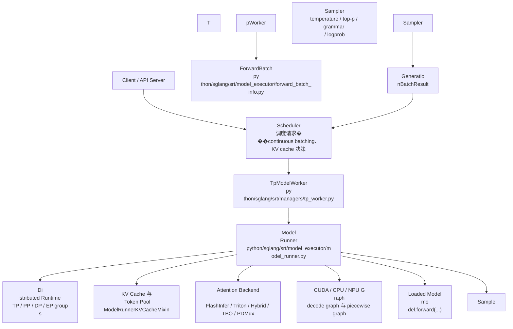
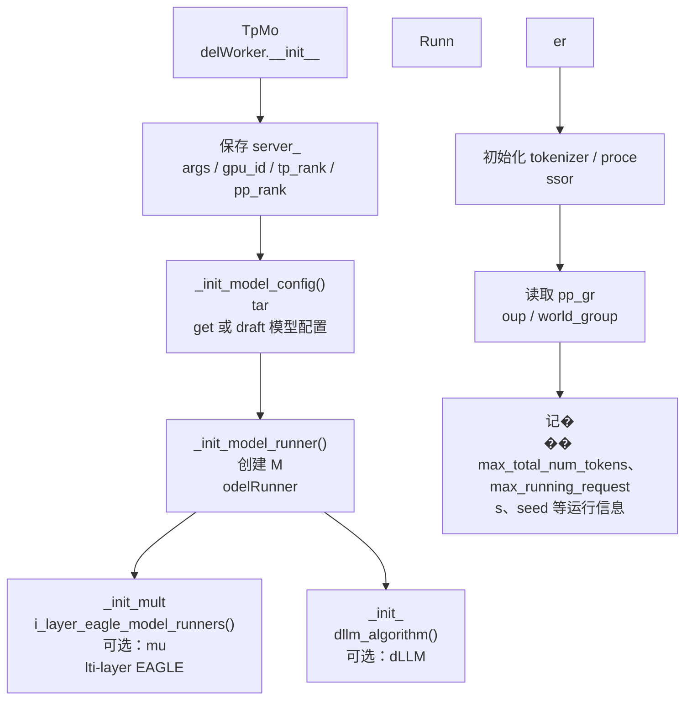

# 架构总览

## 两个文件的位置

`tp
_worker.py` 位于 `python/sglang/srt/manager
s/`，属于 runtime manager 层。它直接�
��接 Scheduler 发来的 batch，并把请�
�送入模型执行层。

`model_runner.py` 
位于 `python/sglang/srt/model_executor/`，
属于模型执行层。它把模型、分布
式通信、KV cache、attention backend、CU
DA graph 和 sampling 组织成一个统一�
�运行时。

## 总体架构图




## 角色分工

| 组件 | 主要职责 | �
�码定位 |
| --- | --- | --- |
| `BaseTpWor
ker` | 定义 Scheduler 可调用的 worker �
��口，并把权重更新、LoRA、memory po
ol 等能力委托给 `ModelRunner` | `tp_wor
ker.py` 的 `BaseTpWorker` |
| `TpModelWorker
` | 初始化 `ModelConfig`、`ModelRunner`�
�tokenizer/processor、PP/TP group，并处�
� generation/split prefill 路径 | `tp_worke
r.py` 的 `TpModelWorker` |
| `ForwardBatch` 
| 把调度层的 batch 转成模型层需要
的张量视图，包括 input ids、position
s、KV cache loc、sampling info | `forward_b
atch_info.py` 的 `ForwardBatch` |
| `ModelRu
nner` | 执行层总控：分布式初始化�
��加载模型、建 KV cache、建 attention
 backend、forward dispatch、sampling | `mod
el_runner.py` 的 `ModelRunner` |
| `Attentio
nBackend` | 根据 batch 元数据准备 atte
ntion kernel 需要的 workspace/metadata | `
model_runner.py` 的 `init_attention_backend(
)` 和 `_get_attention_backend()` |
| `Sample
r` | 对 logits 做采样或 logprob 计算 |
 `model_runner.py` 的 `sample()` 与 `comput
e_logprobs_only()` |

## TpModelWorker 的架
构



`TpModelWorke
r` 的关键点不是直接跑模型，而是
处理“当前 worker 在整个并行拓扑�
��的身份”。例如：

- 当前 worker �
��否是 draft worker，决定加载 target �
��型还是 draft 模型。
- 当前 PP rank 
是否是最后一级，决定是否可以采
样。
- 当前是否启用 overlap、grammar
、speculative decoding 或 dLLM，决定生�
��路径如何分支。
- 当前是否处于 
split prefill，决定复用还是新建 `For
wardBatch`。

## ModelRunner 的架构

```m
ermaid
flowchart TB
    MRInit["ModelRunner._
_init__"] --> RuntimeState["保存 rank、dev
ice、dtype、并行配置、spec 配置"]
  
  RuntimeState --> Dist["init_torch_distribut
ed()<br/>通信组初始化"]
    Dist --> In
itialize["initialize()<br/>主体初始化流
水线"]
    Initialize --> Load["load_model(
)<br/>加载权重与模型对象"]
    Initi
alize --> MoE["_prepare_moe_topk()<br/>MoE �
�由准备"]
    Initialize --> KV["init_memo
ry_pool()<br/>KV cache 与 request-token pool
"]
    Initialize --> Attn["init_attention_ba
ckend()<br/>attention backend"]
    Initializ
e --> Warmup["kernel_warmup() / _dummy_run()"
]
    Initialize --> Graph["init_device_graph
s()<br/>CUDA/CPU/NPU graph"]
    Initialize -
-> Piecewise["init_piecewise_cuda_graphs()<br
/>piecewise graph"]
    Graph --> Forward["fo
rward() / _forward_raw()"]
```

`ModelRunner`
 是一个“执行环境容器”。它不�
�是 `model.forward()` 的薄包装，而是�
��真正执行前把这些状态都准备好�
��

- 分布式通信组：TP、PP、DP、att
ention DP/CP、MoE EP/DP。
- 模型权重与
 dtype/quantization/LoRA/远端权重更新�
�
- KV cache 与请求到 token 的映射池�
��
- prefill/decode attention backend。
- CU
DA graph 或其他设备 graph。
- MoE、spe
culative decoding、HiSparse、HiCache、ngra
m embedding 等可选路径。

## 请求进�
��后的数据层次

```mermaid
flowchart LR

    ScheduleBatch["ScheduleBatch<br/>调度�
��对象"] --> FBInit["ForwardBatch.init_new(
...)"]
    FBInit --> ForwardBatch["ForwardBa
tch<br/>模型层输入"]
    ForwardBatch --
> ModelRunnerForward["ModelRunner.forward(...
)"]
    ModelRunnerForward --> Raw["_forward_
raw(...)"]
    Raw --> Decode["forward_decode
(...)"]
    Raw --> Extend["forward_extend(..
.)"]
    Raw --> Split["forward_split_prefill
(...)"]
    Raw --> Idle["forward_idle(...)"]

```

`ScheduleBatch` 偏向调度视角，�
�录请求、cache、采样配置、是否 pr
efill-only 等状态。

`ForwardBatch` 偏�
�模型视角，记录具体 tensor、positio
ns、cache loc、attention metadata、spec in
fo、sampling info。

这也是理解 SGLang
 runtime 的一条主线：Scheduler 负责�
�哪些请求一起跑”，`TpModelWorker` �
��责“当前 rank 怎么接住这个 batch�
��，`ModelRunner` 负责“怎么把这个 b
atch 高效跑完”。


