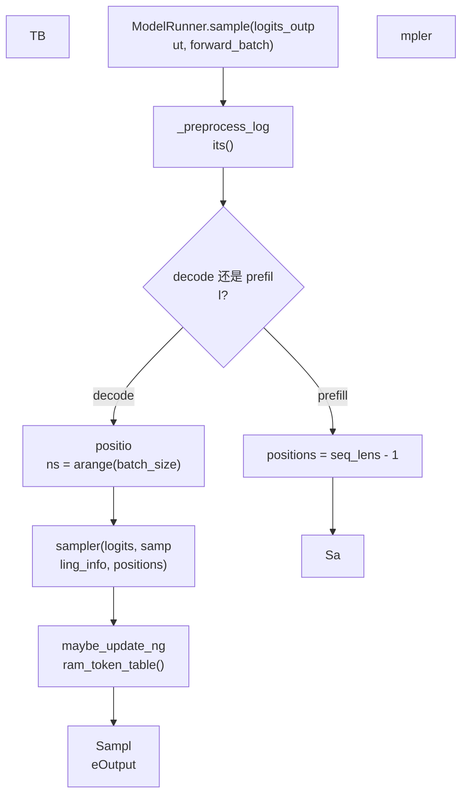

# 详细流程图

## 1. 从 Scheduler 到模
型执行

```mermaid
flowchart TB
    Schedu
ler["Scheduler 选出可运行请求"] --> Sc
heduleBatch["构造 / 更新 ScheduleBatch"]

    ScheduleBatch --> WorkerCall["TpModelWork
er.forward_batch_generation(batch)"]
    Work
erCall --> SetConsumer["设置 HiCache consum
er<br/>可选"]
    SetConsumer --> FB["Forwa
rdBatch.init_new(batch, model_runner)"]
    F
B --> DLLM{"是否 dLLM worker?"}
    DLLM --
 是 --> DLLMPath["_forward_batch_generation_
dllm()"]
    DLLM -- 否 --> PP{"当前 PP ra
nk 是否最后一级?"}
    PP -- 否 --> PP
Forward["ModelRunner.forward()<br/>返回 PPP
roxyTensors"]
    PPForward --> PPResult["Gen
erationBatchResult<br/>只携带 hidden state
 proxy"]
    PP -- 是 --> MRForward["ModelRu
nner.forward()"]
    MRForward --> Verify{"is
_verify?"}
    Verify -- 是 --> ReturnLogits
["直接返回 logits/hidden states<br/>不�
�样"]
    Verify -- 否 --> Sampling{"是否
 prefill-only?"}
    Sampling -- 否 --> Samp
le["ModelRunner.sample(...)"]
    Sampling --
 是 --> Logprob["compute_logprobs_only 或 d
ummy token"]
    Sample --> Result["Generatio
nBatchResult"]
    Logprob --> Result
```

�
�键代码段：

- `TpModelWorker.forward_ba
tch_generation()`：生成入口。
- `Forwar
dBatch.init_new(batch, self.model_runner)`：
调度 batch 到模型 batch 的转换。
- `
self.pp_group.is_last_rank`：区分 PP 中�
�级和最后一级。
- `self.model_runner.s
ample(...)`：只有最后一级且需要生�
�� token 时才采样。

## 2. TpModelWorker
 初始化

```mermaid
flowchart TB
    Start
["TpModelWorker.__init__"] --> Save["保存 s
erver_args、rank、device、port 等"]
    S
ave --> Config["_init_model_config()"]
    Co
nfig --> Runner["_init_model_runner()"]
    R
unner --> MultiEagle{"是否 multi-layer EAGL
E?"}
    MultiEagle -- 是 --> CreateMany["�
�建多个 draft ModelRunner"]
    MultiEagle
 -- 否 --> Continue["继续"]
    CreateMany
 --> Continue
    Continue --> DLLM["_init_dl
lm_algorithm()"]
    DLLM --> Tokenizer["get_
tokenizer(...) / get_processor(...)"]
    Tok
enizer --> Groups["get_pp_group() / get_world
_group()"]
    Groups --> Capacity["读取 ma
x_total_num_tokens / max_running_requests"]
 
   Capacity --> Seed["同步 random seed"]
  
  Seed --> Ready["worker ready"]
```

`TpMode
lWorker` 初始化期间会立即创建 `Mode
lRunner`。因此模型加载、显存池、a
ttention backend 等昂贵初始化，大多�
��在 `ModelRunner.__init__()` 和 `ModelRunn
er.initialize()` 中发生的。

## 3. Model
Runner 初始化主流程

```mermaid
flowcha
rt TB
    Init["ModelRunner.__init__"] --> Sa
veArgs["保存模型路径、rank、device、
dtype、并行拓扑、spec 配置"]
    Save
Args --> Dist["init_torch_distributed()"]
   
 Dist --> Memory0["记录加载前可用显�
�"]
    Memory0 --> Initialize["initialize(pr
e_model_load_memory)"]
    Initialize --> Loa
dModel["load_model()"]
    LoadModel --> MoE[
"_prepare_moe_topk()"]
    MoE --> Layers["�
�算 start_layer / end_layer / effective laye
rs"]
    Layers --> KVType["configure_kv_cach
e_dtype()"]
    KVType --> Pool["init_memory_
pool()"]
    Pool --> Aux["初始化 ngram、
HiSparse、hidden-state capture 等可选模�
��"]
    Aux --> Backend["init_attention_back
end()"]
    Backend --> Warmup["kernel_warmup
()"]
    Warmup --> Graph["init_device_graphs
()"]
    Graph --> Piecewise["init_piecewise_
cuda_graphs()"]
    Piecewise --> Ready["Mode
lRunner ready"]
```

关键代码段：

- `M
odelRunner.__init__()`：收集运行时配�
�并触发初始化。
- `init_torch_distribu
ted()`：初始化通信组。
- `initialize(
)`：主体初始化编排。
- `load_model()
`：加载权重和模型对象。
- `init_me
mory_pool()`：来自 `ModelRunnerKVCacheMixi
n`，建立 KV cache 与 token pool。
- `ini
t_attention_backend()`：建立 prefill/decod
e attention backend。
- `init_device_graphs(
)`：捕获 decode graph。

## 4. 分布式�
��始化流程

```mermaid
flowchart TB
    D
istStart["init_torch_distributed()"] --> Devi
ce["设置当前 device / gpu_id"]
    Device
 --> Backend["选择 distributed backend"]
  
  Backend --> Mem["读取加载前可用显�
�"]
    Mem --> InitEnv["init_distributed_env
ironment(...)"]
    InitEnv --> Parallel["ini
tialize_model_parallel(...)"]
    Parallel --
> DPAttn["initialize_dp_attention(...)"]
    
DPAttn --> Groups["保存 tp_group / pp_group
 / attention_tp_group"]
    Groups --> Balanc
e["检查 TP rank 间显存是否平衡"]
   
 Balance --> Return["返回 pre_model_load_me
mory"]
```

这一步决定当前进程在所
有并行维度中的位置。后续 `ModelRu
nner.forward()` 能否走 PP proxy、attentio
n TP scatter/gather、MoE EP、DP attention�
�都依赖这里建立的通信组。

## 5. 
forward() 到 _forward_raw() 的分发

```me
rmaid
flowchart TB
    Forward["ModelRunner.f
orward(forward_batch)"] --> Meta["profiling /
 canary / expert distribution recorder"]
    
Meta --> Raw["_forward_raw(forward_batch)"]
 
   Raw --> Context["建立 ForwardContext(att
n_backend)"]
    Context --> GraphCheck{"grap
h_runner 可回放?"}
    GraphCheck -- 是 -
-> Replay["graph_runner.replay(forward_batch)
"]
    GraphCheck -- 否 --> Mode{"ForwardMod
e"}
    Mode -- DECODE --> Decode["forward_de
code()"]
    Mode -- EXTEND / TARGET_VERIFY -
-> Extend["forward_extend()"]
    Mode -- SPL
IT_PREFILL --> Split["forward_split_prefill()
"]
    Mode -- IDLE --> Idle["forward_idle()"
]
    Decode --> Output["ModelRunnerOutput"]

    Extend --> Output
    Split --> Output
  
  Idle --> Output
    Replay --> Output
    O
utput --> Metrics["追加指标、EPLB、debu
g dump、错误恢复"]
```

`forward()` 更�
��“外壳”，负责观测、容错和平�
��逻辑。真正选择 decode/prefill/idle/s
plit 的地方是 `_forward_raw()`。

## 6. 
decode 路径

```mermaid
flowchart TB
    De
code["forward_decode()"] --> Meta["准备模�
��特定 metadata"]
    Meta --> Backend{"是
否 PDMux?"}
    Backend -- 是 --> DecodeBac
kend["decode_attn_backend.init_forward_metada
ta()"]
    Backend -- 否 --> MainBackend["at
tn_backend.init_forward_metadata()"]
    Deco
deBackend --> Call["model.forward(input_ids, 
positions, forward_batch)"]
    MainBackend -
-> Call
    Call --> Logits["返回 logits / 
hidden states"]
```

decode 通常每个请�
�推进一个 token，形状更稳定，所�
�最容易被 `init_device_graphs()` 捕获�
�在 `_forward_raw()` 中回放。

## 7. ext
end / prefill 路径

```mermaid
flowchart TB

    Extend["forward_extend()"] --> Kwargs["�
��备 PP proxy、input_embeds、embedding mod
e 等 kwargs"]
    Kwargs --> Piecewise{"piec
ewise graph 可用?"}
    Piecewise -- 是 --
> PieceReplay["piecewise_cuda_graph_runner.re
play()"]
    Piecewise -- 否 --> Meta["prepa
re_forward_extend_metadata()"]
    Meta --> A
ttn["attn_backend.init_forward_metadata()"]
 
   Attn --> Call["model.forward(input_ids, po
sitions, forward_batch, **kwargs)"]
    Piece
Replay --> Output["logits / hidden states"]
 
   Call --> Output
```

extend/prefill 处理
 prompt token 或新扩展 token，token 数�
�� prefix 长度更动态，所以通常比 d
ecode 更难完全 graph 化。

## 8. split 
prefill 路径

```mermaid
flowchart TB
    S
plit["TpModelWorker.forward_batch_split_prefi
ll()"] --> FB{"是否已有 forward_batch?"}

    FB -- 否 --> NewFB["ForwardBatch.init_ne
w(batch, model_runner)"]
    FB -- 是 --> Re
use["复用已有 ForwardBatch"]
    NewFB --
> MR["ModelRunner.forward(split_forward_count
=...)"]
    Reuse --> MR
    MR --> RunnerSpl
it["ModelRunner.forward_split_prefill()"]
   
 RunnerSplit --> Range["计算 split_index / 
next_split_index"]
    Range --> Model["model
.forward_split_prefill(...)"]
    Model --> M
aybeSample{"是否产生 logits?"}
    MaybeS
ample -- 是 --> Sample["ModelRunner.sample(.
..)"]
    MaybeSample -- 否 --> Continue["�
�续下个 split"]
```

split prefill 的核�
��是把一次长 prefill 拆成多个片段�
��让显存压力和单步延迟更可控。


## 9. sampling 流程



`sample()` 不只是从 logits
 里取 token。它还会处理 grammar、log
it bias、temperature/top-p/top-k、return_lo
gprob，以及 ngram embedding token table �
�维护。


